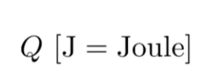
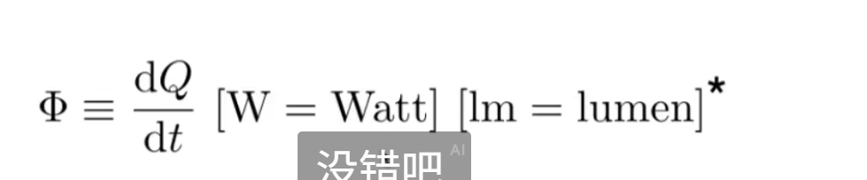
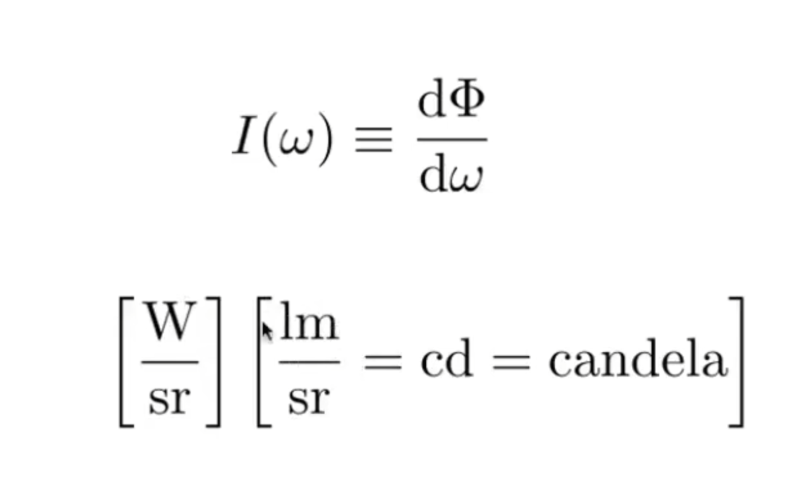
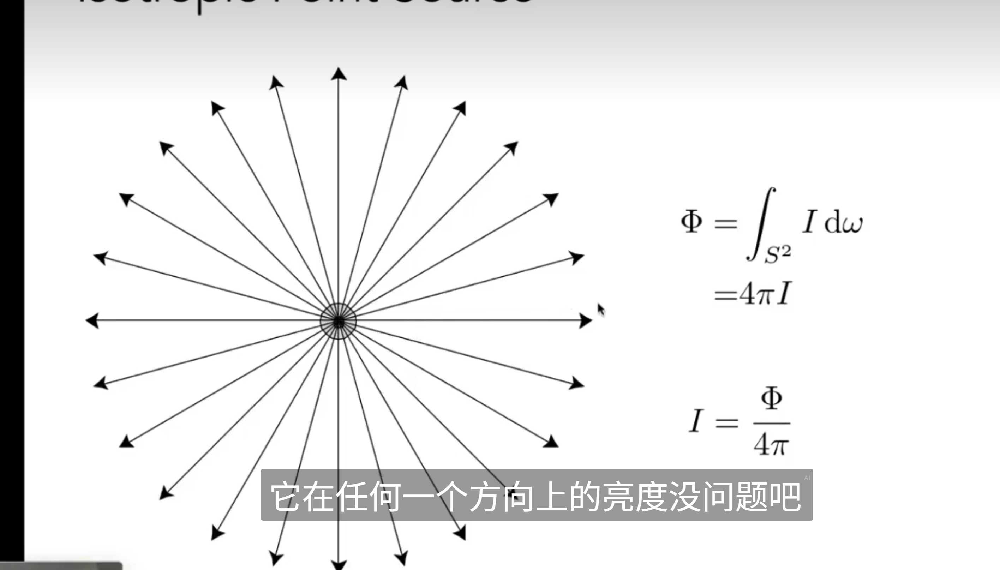
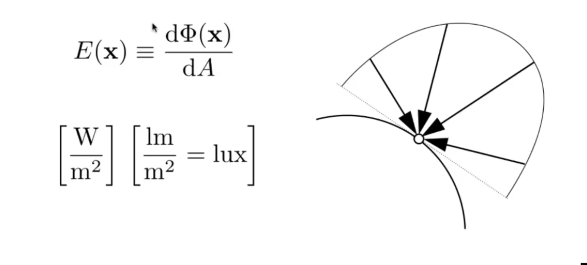

# 辐射度量学

## Radiant Energy and Flux

Radiant Energy代表的是电磁辐射的能量

Radiant Flux（power），单位时间的能量，也就是功率

 Radiance Flux还可以这样理解：给一个光源单位时间内辐射多少光子

## Radiant intensity

单位立体角上的能量（Radiant Flux / unit solid angle）（单位时间，单位立体角上的enegry）

 

Irradiance

