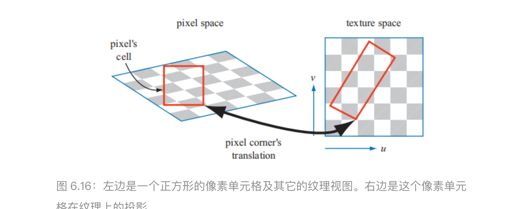
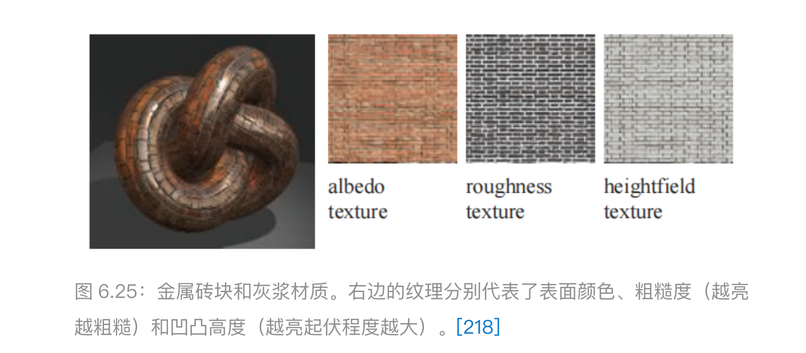
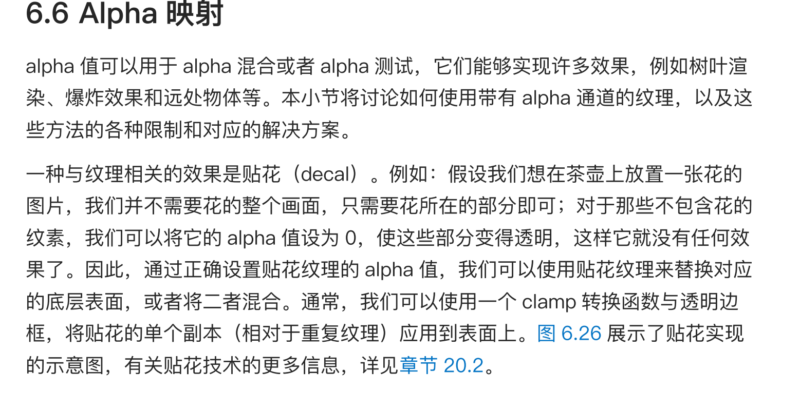
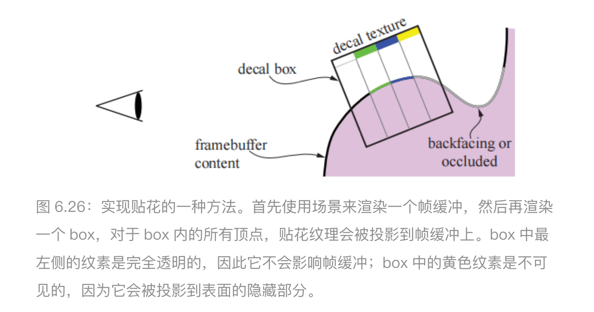
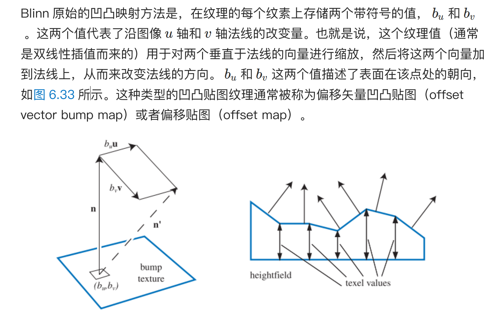
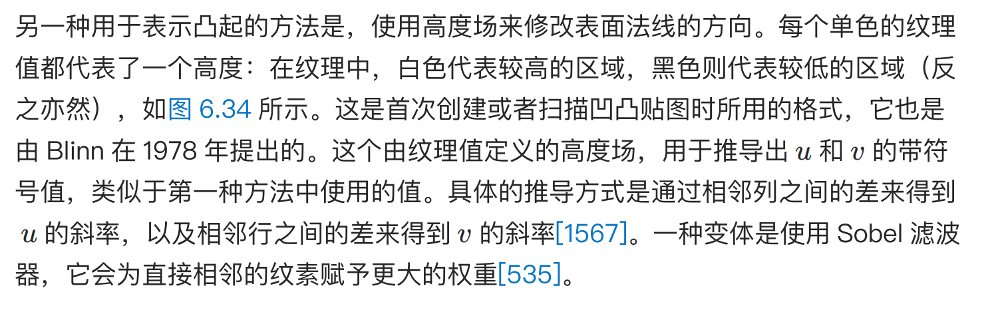
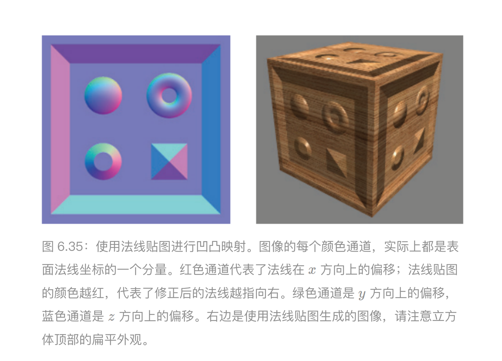

# Texture

采样流程：

投影，转换，取值

投影是指，获取一个表面的坐标，然后将其投影到纹理坐标空间当中。这个纹理坐标空间通常是⼀个⼆维 (*u*, *v*) 空间

转换函数（corresponder function）⽤于将纹理坐标转换为纹理空间中的具体位置，它们提⾼了在表⾯上应⽤纹理的灵活性。

## 过滤：

### 多个像素一个纹素

### 一个像素多个纹素

https://blog.csdn.net/qq_40765480/article/details/136912739

https://zhuanlan.zhihu.com/p/627798818

1. 临近采样

2. Mipmap

   1. Mipmap是以空间换时间。那么mipmap对比原本的贴图会多出多少空间呢？

      答案是：1/3 

3. SAT表

4. 各向异性纹理过滤

各向同性Mipmap存储模式(左），各向异性Mipmap图片存储模式(右)，来源： 维基百科

## 材质映射

## 凹凸映射

凹凸贴图存储的内容，是相对于每个顶点的切线空间下的

1. Blinn

Blinn 原始的凹凸映射⽅法是，在纹理的每个纹素上存储两个带符号的值， $b_u$和$b_v$。这两个值代表了沿图像 轴和 轴法线的改变量。

2. 法线贴图

凹凸贴图的⼀个常⽤⽅法是直接存储法线贴图（normal map）

