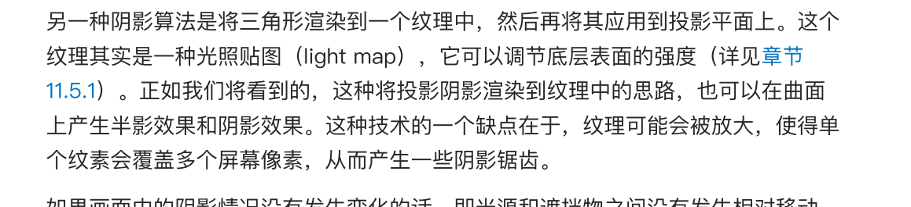
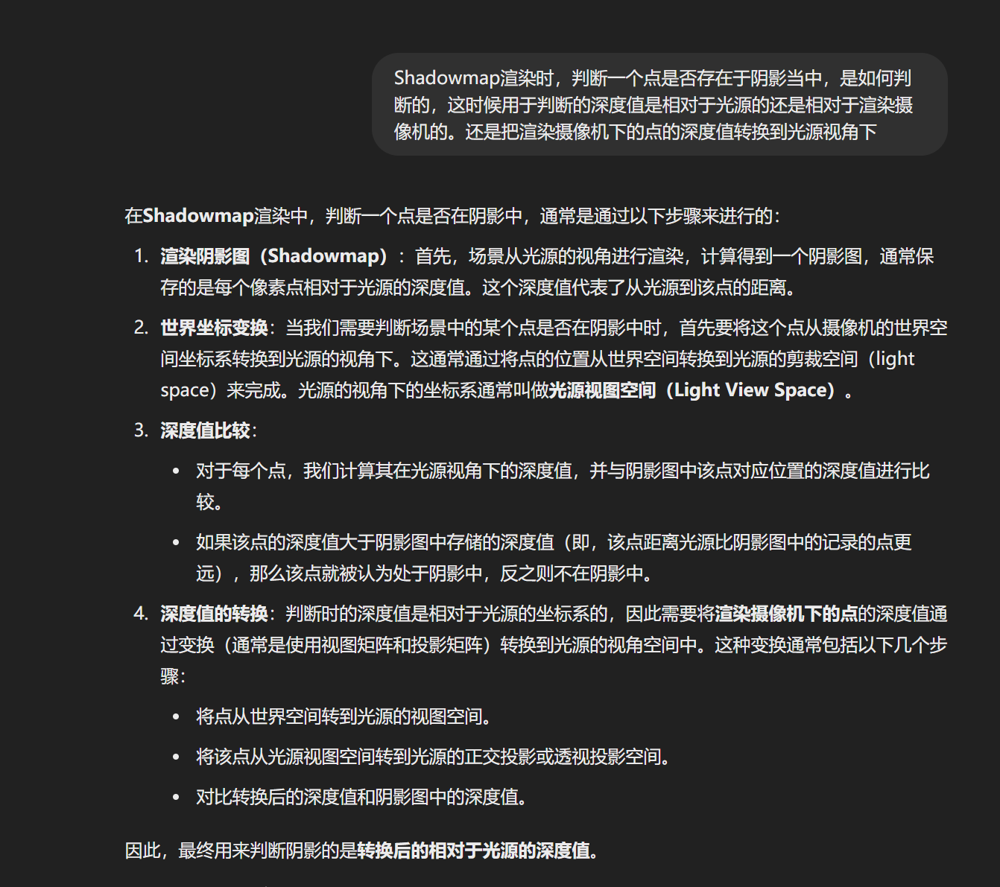

# Shadow

## 平面阴影

### 1.投影阴影(硬阴影)

计算一个投影矩阵，把一个物体投影到一个平面然后渲染即可

### 2. 软阴影

阴影体算法：

https://zhuanlan.zhihu.com/p/353390689

1. 朴素
2. 使用模板缓冲区
   1. 先绘制模型三角形，写入FrameBuffer和深度缓冲区
   2. 锁定深度缓冲写入和FramaeBuffer缓冲
   3. 通过深度测试的情况下，尝试绘制阴影体：
      1. 第一次绘制阴影体正面，可以绘制那么模板缓冲区+1
      2. 第二次绘制阴影体背面，可以绘制模板缓冲区-1
   4. 模板缓冲区为0的就是阴影部分

ShadowMap

shadowmap存在的问题：

1. 自阴影：

   由于处理器精度问题，即使是在同一个位置且没有被遮挡，一个点的基于光源的存储深度值和观察表面的深度值

2. 锯齿

   

3. 阴影偏移

   在第一个自阴影的基础上做的处理方法就是，给一个恒定值的偏移量，这样会造成阴影的偏移

级联阴影贴图

### 3. 自投影

