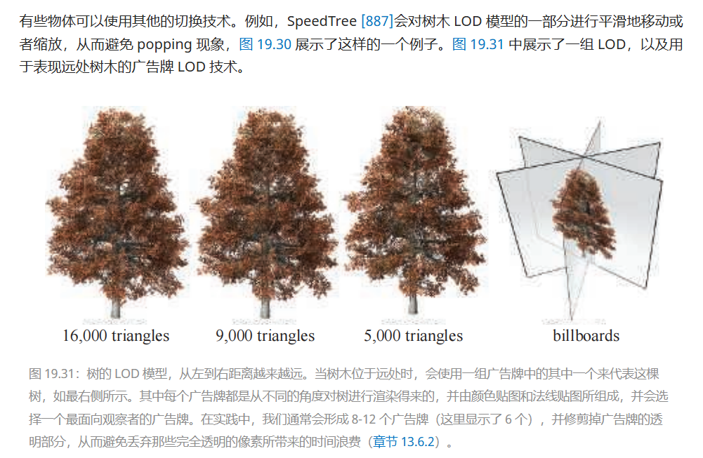

# 加速结构

## BVH

1. BVH唯一额外需要的信息就是最近对象的距离和身份。在一个父级节点当中，会首先排序子集的边界体积，找到最近的一个，如果能从这个子集结构当中找到最新的交点，那就用这个最近的交点去剪枝其他的子集

2. BVH物体移动：1. 判断是不是依然在边界里面，如果还在就不变，如果不在了，就重新从根节点插入2.动态边界，比如一个摆锤

## BSPTree

二叉空间分割树，简称BSP树，在计算机图形学中存在两种明显不同的变体，我们称之为轴对齐和多边形对齐。这些树是通过使用一个平面将空间分成两部分来创建的，然后将几何体排序到这两个空间中。这种分割是递归进行的。一个值得注意的特性是，如果以某种方式遍历BSP树，树中的几何内容可以从前到后排序，无论从哪个视角看都是如此。这种排序对于轴对齐的BSP树是近似的，而对于多边形对齐的BSP树则是精确的。请注意，轴对齐的BSP树也被称为k-d树。

### KD-Tree

有的KD-Tree会固定一个轴的位置，有的是移动的

一个与平面相交的对象可以以多种方式进行处理。例如，它可以存储在树的这一层级，或者成为两个子盒子的成员，或者被平面真正地分割成两个独立的对象。在树层级存储的优势在于树中只有一个对象的副本，使得对象删除变得简单直接。然而，被分割平面相交的小对象会卡在树的上层，这往往会导致效率低下。将相交的对象放入两个子盒子中可以为较大的对象提供更紧密的边界，因为所有对象都会渗透到一个或多个叶节点，但只限于它们重叠的部分。每个子盒子包含一定数量的对象，这个平面分割过程会重复进行，递归地对每个轴对齐的边界体积（AABB）进行细分，直到满足某个标准来停止这一过程。参见图19.3以获取轴对齐的二叉空间分割（BSP）树的一个示例。

## 剔除（Cull）：

### 背面剔除：

对于单一三角形：

通过把相对于摄像机视角的，为背面的三角形剔除，来减少提交到Pipeline的数据的量

两种方法确定背面三角形：一个是通过根据三角形顶点顺序计算三角形的带符号面积（其实就是求Cross）。第二个是在三角形上任意取一个点(一般是顶点)，然后得到一个从顶点指向Camera的向量（如果是正交投影的话，就是负观察空间的方向，是一个常量）。如果这个向量和三角形法线夹角大于90（也就是求cos<0)，那么就是背面

> Blinn指出，这两种测试在几何上实际上是相同的[165]。从理论上来说，这些测试的区别主要在于计算测试的空间（坐标系），而不是其他因素。在实践中，屏幕空间中的测试通常会更加安全，因为在观察空间中看起来稍微向后的倾斜（edge-on）三角形，在屏幕空间中可能会变得稍微向前，这是因为观察空间中的坐标会被四舍五入为屏幕空间中的亚像素坐标。

对于一组三角形：

1. 集群背面剔除算法

## 遮挡剔除

#### 遮挡查询：

对于一组三角形，CPU向GPU发送一个遮挡查询，GPU会光栅化这一组三角形（这组三角形一般都会组成一个BV，包围一个更复杂的物体），然后判断这组三角形能不能完全被当前的Z-Buffer遮挡。如果被完全遮住，或者不被遮住的光栅化部分小于一个阈值的话，那么就是遮挡成功。

在遮挡模型当中，CPU和GPU会维护一个查询队列。GPU把查询结果放到队列里，让CPU来取。CPU可以异步的发送查询请求，然后从队列里定期的查询结果。

> DirectX和OpenGL都支持断言/条件（predicated/conditional）的遮挡查询，其中遮挡查询与对应draw call的ID会被同时提交。只有当遮挡查询的几何物体可见时，GPU才会自动处理相应的draw call，这使得查询模型更加实用。

某个物体的当遮挡查询通过之后，CPU通过队列得知，然后决定是否要调用DrawCall，决定是否要把物体进行渲染

## LOD

### 离散几何LOD

在最简单类型的LOD算法中，不同版本的LOD表示实际上是同一个物体模型，但是包含了不同数量的图元（三角形）

LOD存储在现存里面，然后直接切换

###  混合LOD

> 首先将LOD1以不透明的方式，渲染到帧缓冲中（即颜色缓冲和z-buffer）。然后将LOD2的alpha值从0逐渐增加到1，并使用“over”混合模式来淡入LOD2。当LOD2的alpha值为1时，此时LOD2是完全不透明的，使其变成当前使用的LOD，然后再让LOD1淡出。正在淡出那个的LOD应当在启用深度测试（z-test）和禁用深度写入（z-write）的情况下进行渲染。为了避免在渐变LOD的渲染结果上叠加绘制远处的物体，只需要在所有不透明内容绘制完成之后，再按照前后顺序来绘制所有的渐变LOD即可，就像在渲染透明物体时所做的那样。

### Alpha LOD

> 一个避免popping的简单方法是使用alpha LOD。这个技术可以单独使用，也可以与其他LOD切换技术结合使用。它应用在最简单的可见LOD上，如果只有一个LOD可用的话，也可以直接应用在原始模型上。当用于LOD选择的度量（例如：到该物体的距离）逐渐增加时，该物体的整体透明度也会逐渐增加（即\alpha减小），当物体达到完全透明（\alpha = 0.0）时，它最终会消失。当这个LOD度量值大于用户定义的不可见阈值时，就会发生这种情况；在达到不可见阈值的时候，只要这个LOD度量值保持在阈值之上，就不需要将物体发送到渲染管线中。如果一个物体此时是不可见的，并且其LOD度量值低于不可见阈值时，它就会降低其透明度（即\alpha增大）并重新开始变得可见。另一种选择是使用章节19.9.2中描述的延迟方法。

### CLOD/地貌LOD

边坍缩：可以根据距离更自由的控制模型的LOD

> 每次执行边坍缩操作之后，模型的三角形都会减少两个。在边坍缩操作中，有一条边会被缩短，直到这条边的两个端点重合，然后这条边就消失了。如果将这个过程动画化，那么就可以在原始模型和略微简化的模型之间进行平滑过渡。对于一次边坍缩过程而言，一个顶点会与另一个顶点相重合；而在一系列的边坍缩过程中，一组顶点会发生移动，并与另一组顶点相重合。通过存储这一系列的边坍缩操作，可以逆转这个过程，这样做的话，一个简化的模型就可以随着时间的推移，逐渐变得更加复杂。边坍缩的翻转过程被称为顶点分裂（vertex split）。因此，这种改变物体LOD的精确方法是，可以根据LOD选择值来确定可见三角形的数量。在100米外，模型可能会由1000个三角形组成；而当移动到101米时，它可能会下降到998个三角形。这种方案被称为连续LOD技术（continuous level of detail，CLOD）。因此，这并不是一组离散的模型，而是一组可供显示的庞大模型集合，每个模型的三角形都要比相邻模型（更复杂的那个邻居）少两个