# 管线


IA

顶点着色器

​	曲面细分和几何着色器

​	裁剪

光栅化阶段

 **Early-Z 深度测试**

片元着色器

逐样本操作

# 线性空间和Gamma空间


# 前向渲染和Deferred Shading(延迟着色) 

https://zhuanlan.zhihu.com/p/665141552

前向渲染：

每个顶点/片元都要执行一次片元着色器代码，这时需要将所有的光照信息都传递到片元着色器。也就是说，即使光源本身都很小，并且光源本身只照亮了一小部分顶点，但是对于每个片元，也依然要在计算光照时考虑所有的光源。

前向渲染对于光源有这样的要求：

1. 最亮的几个光源被实现为像素光照（片元着色器当中）
2. 然后最多4个光源被实现为顶点光照
3. 剩下的光源会被实现为效率较高的球面调谐光照

前向渲染在Unity中是多pass的

base pass是里执行一盏像素光、所有的顶点光和球面调谐光照，并且进行阴影计算

其余的像素光每盏一个Additional Pass，并且这些pass里没有阴影计算。

延迟渲染

延迟渲染被分成两个pass

第一个pass称为几何处理通路。首先将场景渲染一次，获取到待渲染对象的各种几何信息存储到名为[G-buffer](https://zhida.zhihu.com/search?content_id=235938469&content_type=Article&match_order=1&q=G-buffer&zhida_source=entity)的缓冲区中，这些缓冲区将会在之后用作更复杂的光照计算。由于有深度测试，所以最终写入G-buffer中的各个数据都是离摄像机最近的片元的几何属性，这意味着最后在G-buffer中的片元必定要进行光照计算的。

第二个pass称为光照处理通路。该pass会遍历所有G-buffer中的位置、颜色、法线等参数，执行一次光照计算。

> 如果GBuffer太大了 ，可以去掉什么优化空间？
>
> **世界空间/视图空间位置 (Position XYZ)**:
>
> - **如何去掉/优化**: 这是最常被优化的 G-Buffer 组件之一。你可以不直接存储完整的 `(X, Y, Z)` 位置，而是只存储**深度值 (Depth)**。然后在光照阶段，利用深度值、当前像素的屏幕坐标以及相机的投影和视图逆矩阵来重建世界空间或视图空间位置。
>
> - 代价/影响
>
>   :
>
>   - 需要在光照着色器中进行额外的计算来重建位置。

1.前向渲染的优点和缺点

(1) 优点

1、支持半透明渲染

2、支持使用多个光照pass

3、支持自定义光照计算方式

(2) 缺点

1、光源数量对计算复杂度影响巨大

2、访问深度等数据需要额外计算

2.延迟渲染的优点和缺点

(1) 优点

1、大量光照场景优势明显

2、只渲染可见像素，节省计算量

3、对后处理支持良好

4、用更少的shader

(2) 缺点

1、对MSAA支持不友好（因为G-Buffer存储的是已经光栅化了的片元，无法细分）

2、透明物体渲染存在问题 (因为G-Buffer保留的都是离相机最近的片元，深度会有问题，**渲染透明物体只能使用前向渲染的方式向渲染**)

3、占用大量的显存带宽 (存储G-Buffer)

由于在计算光照时所有的网格信息已经全部被转换为了像素信息，这也就意味着我们不能从像素当中去得知这是哪一个几何体，运用了哪一个光照，如果不加以改进，就意味着场景中所有的物体都必须使用相同的光照进行计算。

https://zhuanlan.zhihu.com/p/381682257

# 阴影

阴影算法：

1. ShadowMapping

   > Q: ShadowMapping的问题以及如何解决

# 剔除

https://zhuanlan.zhihu.com/p/66407205

# alpha

alpha-test会根据片元的alpha值来决定是否剔除（discord）当前片元，因此会导致early-z失效（原因是，如果先做了early-z，然后early-z只保留了最前面的片元信息，结果这个片元没通过alpha-test，那么在屏幕上就会出现一个洞）

alphablend也是一样的，这部分的问题是alpha-blend是需要混合前后的片元，因此他是需要那些可能被遮挡的信息的


# 碰撞检测

## 离散型


## CCD

https://github.com/acrlw/Physics2D/blob/master/Physics2D/source/collision/physics2d_ccd.cpp

整体的思路是通过越来越细化的碰撞来找到一个符合目标精度的碰撞事件（TOI）

注意，即使是CCD所谓的连续检测，但是在计算机中也是只有离散的

> 考虑情景：一颗子弹打向一堵墙，我们需要预测在未来dt的时间内是否会发生碰撞

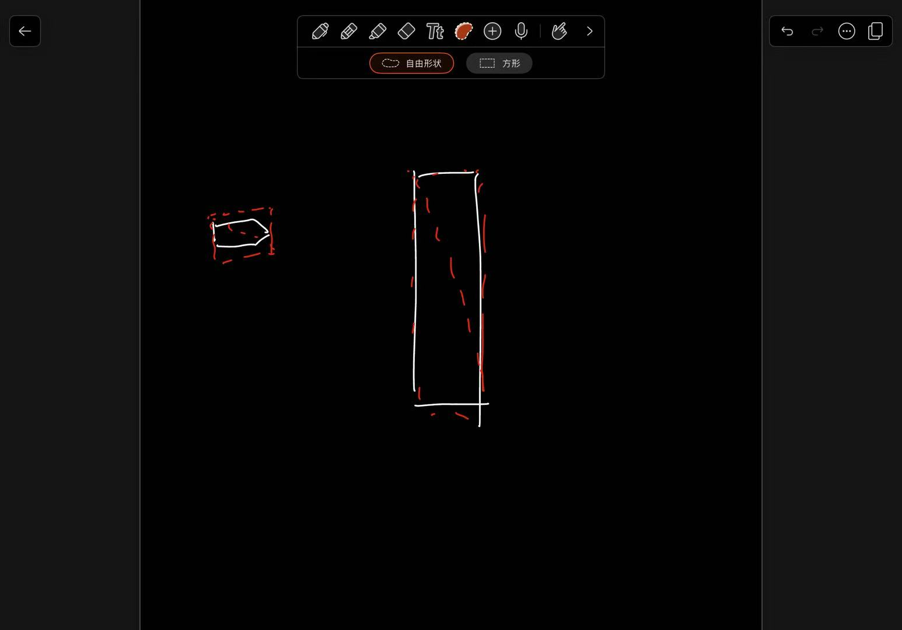

分为三步：

1. 构建运动轨迹包围盒

   为了预测在下一个时间步 `dt` 内是否会发生碰撞，CCD模块首先需要估算物体在此时间段内可能占据的空间。这是通过对物体的运动进行采样，并为每个采样点生成一个轴对齐包围盒 (AABB) 来实现的。

   也就是说，我们会以一个粒度来细分这个dt，这个粒度（slice，是认为设置的）

   

   ```c#
   // physics2d_ccd.cpp - 简化示意
   std::tuple<CCD::BroadphaseTrajectory, AABB> CCD::buildTrajectoryAABB(Body* body, const real& dt)
   {
       // ... (记录初始状态 startBox, startAttribute)
       body->stepPosition(dt); // 模拟完整运动
       // ... (记录结束状态 endBox, endAttribute)
   
       if (startBox == endBox && /* 速度较低 */)
       {
           // ... (简化轨迹)
           return std::make_tuple(trajectory, result);
       }
   
       // ... (计算总包围盒 result.unite(startBox).unite(endBox))
       body->setPhysicsAttribute(start); // 恢复初始状态
   
       real slice = 40;
       real step = dt / slice;
       for (real i = dt / slice; i <= dt; i += step)
       {
           body->stepPosition(step);
           AABB aabb = AABB::fromBody(body);
           trajectory.emplace_back(AABBShot{ aabb, body->physicsAttribute(), i });
           result.unite(aabb); //通过聚合所有轨迹的离散状态，来获得一个大的AABB
       }
       // ... (恢复初始状态)
       return std::make_tuple(trajectory, result);
   }
   ```

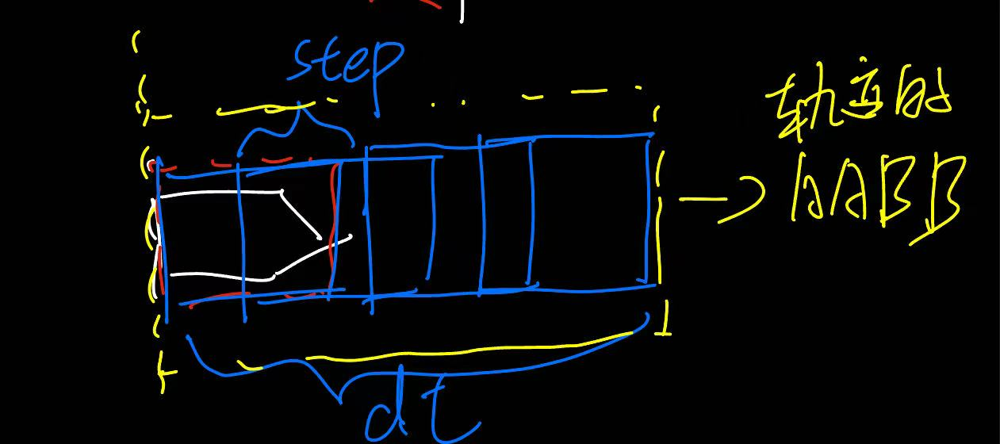

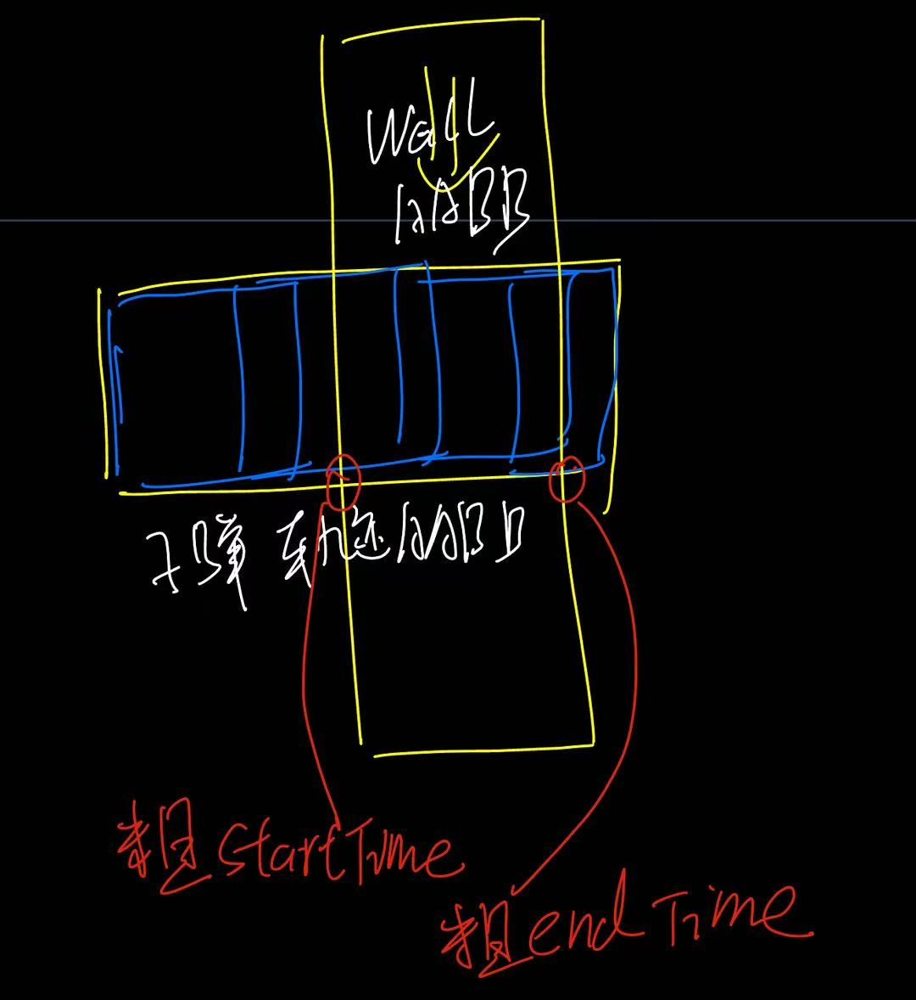


2. 粗略阶段的碰撞时间估计

现在我们通过获取两个物体的轨迹，现在需要获取一个区间，这个区间是一个粗略估计的，二者发生碰撞的开始时间，和结束时间组成的。

首先，计算两条轨迹各自的总AABB（通过合并轨迹的第一个和最后一个AABB），如果这两个总AABB不碰撞，表示不可能发生碰撞。

如果总AABB碰撞，遍历动态物体的AABB轨迹序列。对于序列中的每一小段（注意：由相邻两个`AABBShot`的AABB合并而成），检查它是否与静态物体的总轨迹AABB碰撞。

这样我们就能找到动态物体轨迹中最早和最晚可能与静态物体轨迹发生碰撞的片段（的一个估计的区间)

3. 精确阶段的碰撞时间确定

当粗略阶段找到了一个可能发生碰撞的时间区间后，需要进行更精确的计算来确定实际的碰撞时间 (TOI)。

这里主要包括：前向搜索与回溯，TOI细化

- 前向搜索与回溯： 、

  - 在一个循环中，以较小的时间步 `step` （例如，`step = (endTimestep - startTimestep) / slice`，`slice` 可能为30）向前模拟动态物体的运动。
  - 在每一步模拟后，都使用离散的检测方法检测一下是否碰撞。，如果检测到了碰撞，那么就说明在当前的小时间步里发生了碰撞，这时就要发生回溯
  - 回溯：如果检测到碰撞 (`result` 为真)，则说明在当前小时间步内发生了碰撞。此时，它会回退一步 (`forwardSteps -= step; dynamicBody->setPhysicsAttribute(lastAttribute);`)，并进入更精细的TOI查找阶段。

- TOI细化：

  - 如果在前向搜索中找到了碰撞，现在开始减小时间步 `step /= 2.0f`。

    在一个循环中（有最大迭代次数 `Constant::CCDMaxIterations` 限制），向前模拟一小步 `step`。

    调用 `Detector::detect(staticBody, dynamicBody)` 获取详细的碰撞信息，包括渗透深度 `result.penetration`。

    如果碰撞并且渗透深度小于某个非常小的值 `epsilon`（或者达到最大迭代次数），则认为找到了足够精确的TOI，返回 `startTimestep + forwardSteps`。

    如果碰撞但渗透深度较大，则说明这一步迈得太远，需要回退 (`forwardSteps -= step; dynamicBody->setPhysicsAttribute(lastAttribute);`) 并进一步减小时间步 (`step /= 2.0;`)。

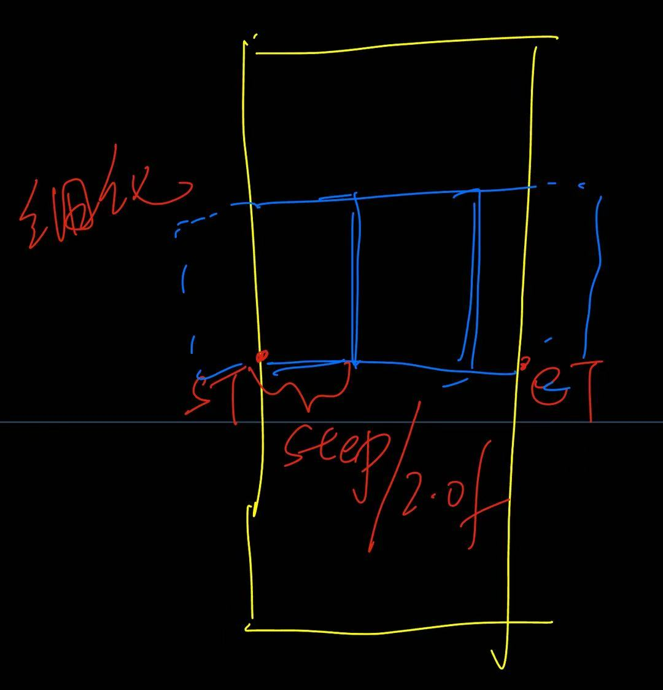


https://cloud.tencent.com/developer/article/2016951?policyId=1004

# 阴影技术

直接看RTR4算了https://www.wolai.com/cYLxaNaJYfPnRc66myZvtg

## 静态阴影


## 动态阴影

### 硬阴影

1. 投影阴影

也就是直接计算一个投影方式，从光源出发，把物体的形状投影到一个平面上

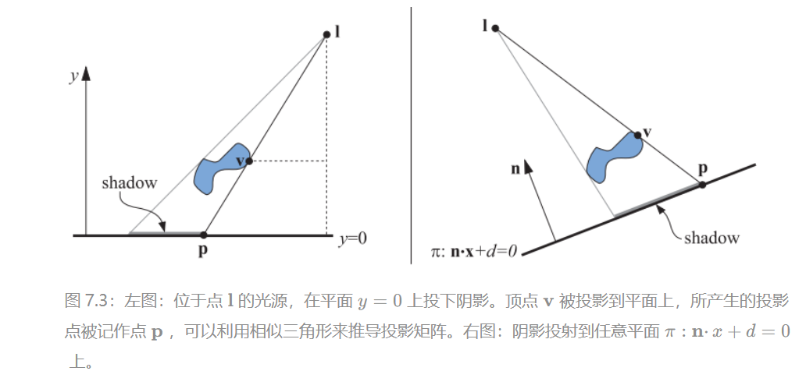

> 存在的问题：
>
> 1. 这个方法绘制阴影的方式很粗暴，就是直接把某个位置的颜色涂深，但是很容易想到的，需要一个方法让阴影颜色后渲染，否则会有遮挡
>    1. 解决方法：先绘制平面，然后再绘制阴影，并且需要一些偏移让投影后的三角形总是绘制在投影平面的前面
> 2. 如果投影到的平面是有边界的，那么阴影就可能会出边界
>    1. 解决方法：模板缓冲区。首先将接收物分别绘制到屏幕和模板缓冲区上，然后关闭z-buffer，使用模板缓冲区作为遮罩，只在有颜色的地方绘制投影后的三角形，最后再正常渲染场景的剩余部分。

2. shadow mapping

比正常的方法多一个pass。

1. 生成一个，由光源出发渲染的一个深度图
2. 主通道，绘制场景画面，这个时候，当需要渲染场景中的某个像素的时候，就把这个点的world position转换到光源视角下，然后去查询那个深度图，然后比较这个查询到的深度图的里存储的深度和这个点在光源视角下实际的深度，来看他能不能被看到

> 存在的问题：
>
> 1. 自遮挡：(主要是由于精度问题)
> 2. 走样问题

3. PCF和PCSS的区别

   1. PCF的思想是固定尺寸的模糊，对于shadowmap采样的时候不是只采样一次，而是在采样点周围一个固定的区域内进行多次采样然后计算被遮挡的百分比，进行柔和

   2. PCSS则是对PCF的改进，目标是模拟真实世界中阴影随着和光源距离，光源大小，阴影接收点和遮挡物距离等因素造成的半影大小不同的效果

      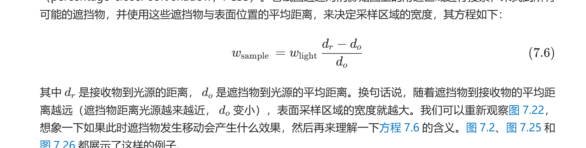

4. 过滤阴影贴图（VSM）

   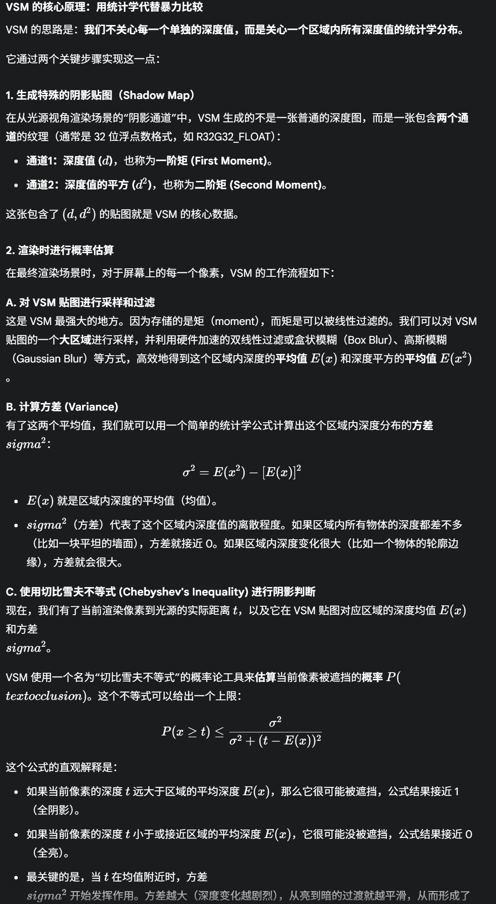

   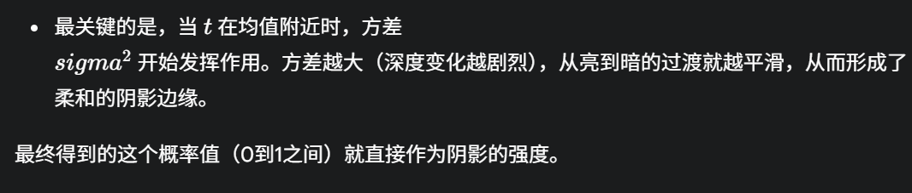

> 过滤：因为图形学本质上是对于信号进行采样，“过滤” (Filtering)**，在计算机图形学中，特指**纹理过滤 (Texture Filtering)**。简单来说，它是一种**“模糊”或“平滑化”**处理技术。
>
> 切比雪夫不等式在这里的意义：x代表的是shadowmap里存储的值，然后t代表的是当前查询点实际上到光源的深度值。所以这个里的意义是，P(x>=t)，就是shadowmap里的值x可能大于t的概率上界是多大（x>t意思就是说，t在x前面，也就是有多大概率不被遮挡），并以此作为光照强度

# 贴图

## 1. mipmap 二维前缀和

mipmap额外消耗1/3的空间

Mipmap的问题：过度模糊L

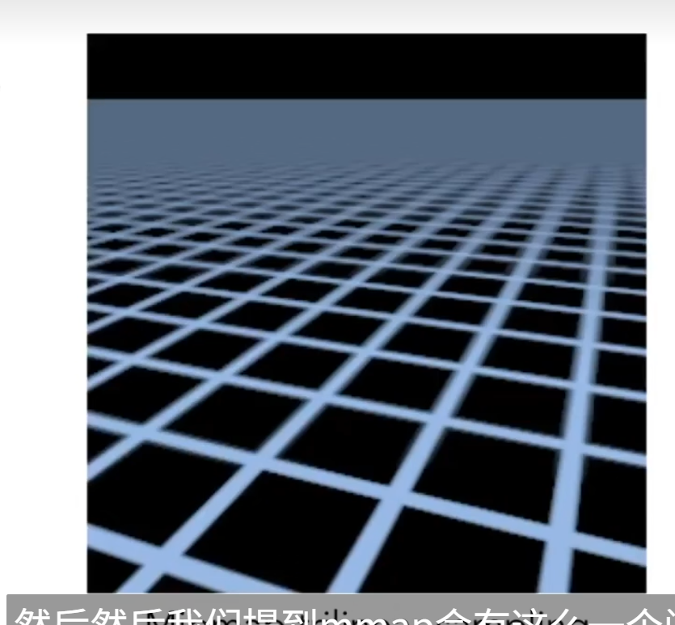

为什么掠射的那部分也就是正对着的部分会过度模糊？这是因为，我们选择MipMap的层级的时候，是根据选择一个像素，它在纹素上横纵移动的偏移量中最长的那个来计算的。

这就导致了，如果是掠射，那么（比如对于这个例子中），远离摄像机的这个方向的长度，远远长于平行于摄像机的长度，那么就会导致选择一个过高的mipmap模糊等级。（右图就是一个掠射）

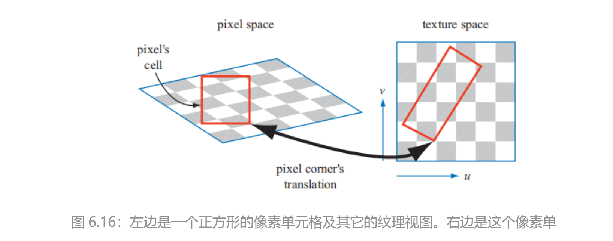

所以需要各向异性（三倍）

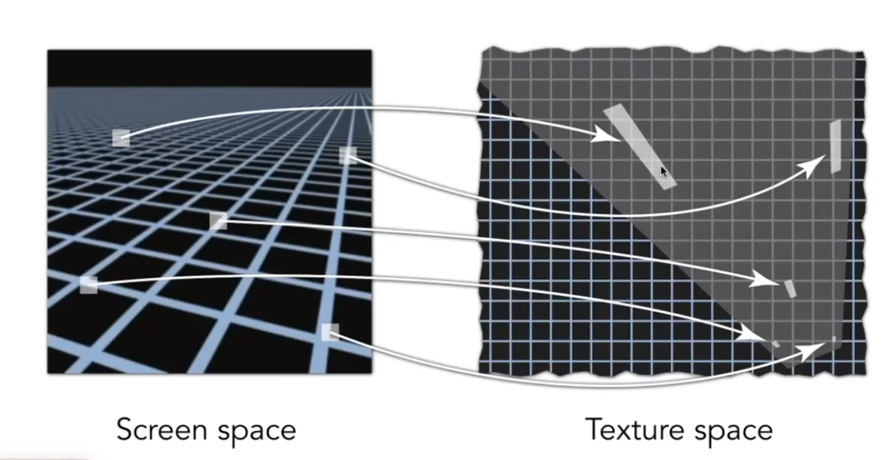

## 2. SAT算法：二维前缀和

可以快速的得到一片区域当中的，纹理像素的值的总和

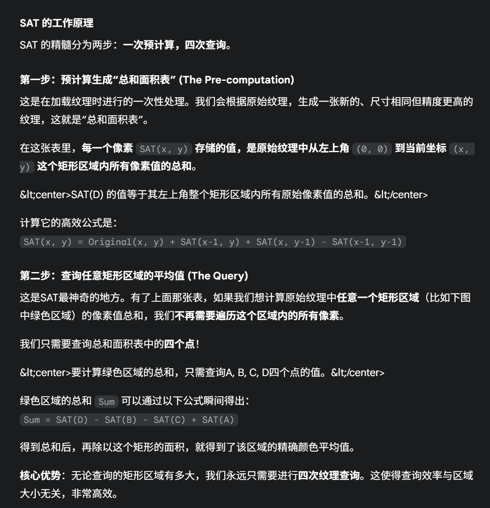

## 3. altas 图集

当使用 wrapping/repeat或者mirror模式的时候，是无法使用纹理图集的。因为这些模式会对整个纹理产生影响，导致我们无法对子纹理进行正确的设置。

对于上述的这些问题，一个更简单的解决方案是使用一种被称为纹理数组

# PBR

## BRDF（其实是一种定义材质的方式）

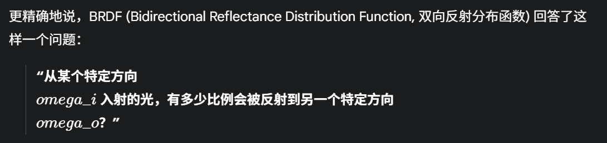

https://zhuanlan.zhihu.com/p/490024846

https://zhuanlan.zhihu.com/p/393371982

## 渲染方程

利用brdf做渲染

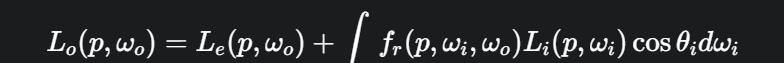

# 透明

半透明是如何渲染的

C_out=C_source X alpha_source+C_destination X (1−alpha_source)

渲染引擎通常需要禁用深度写入（Z-Write），但保持深度测试（Z-Test）开启。

渲染透明需要排序。

这里的排序是，先把非透明的背景，按照正常的方式渲染，写入ZBuffer。然后关闭ZWrite，但是开启深度测试，这时候深度测试当中存储的是背景的不透明物体。然后做透明物体的混合。

关闭ZWrite的目的是，为了防止半透明物体挡住了它背后的物体被渲染，

# AA

MSAA的开销是测试子像素点是否可见（或者说在三角形中）（几何边缘检测），而SSAA的开销是子像素采样
