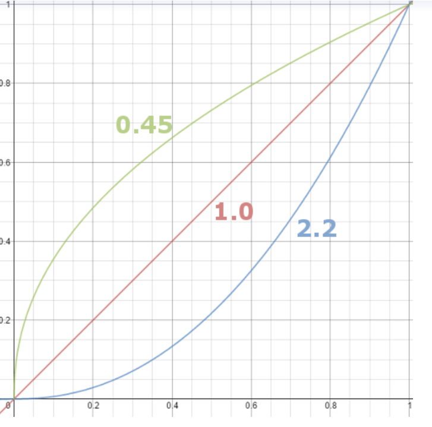
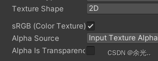
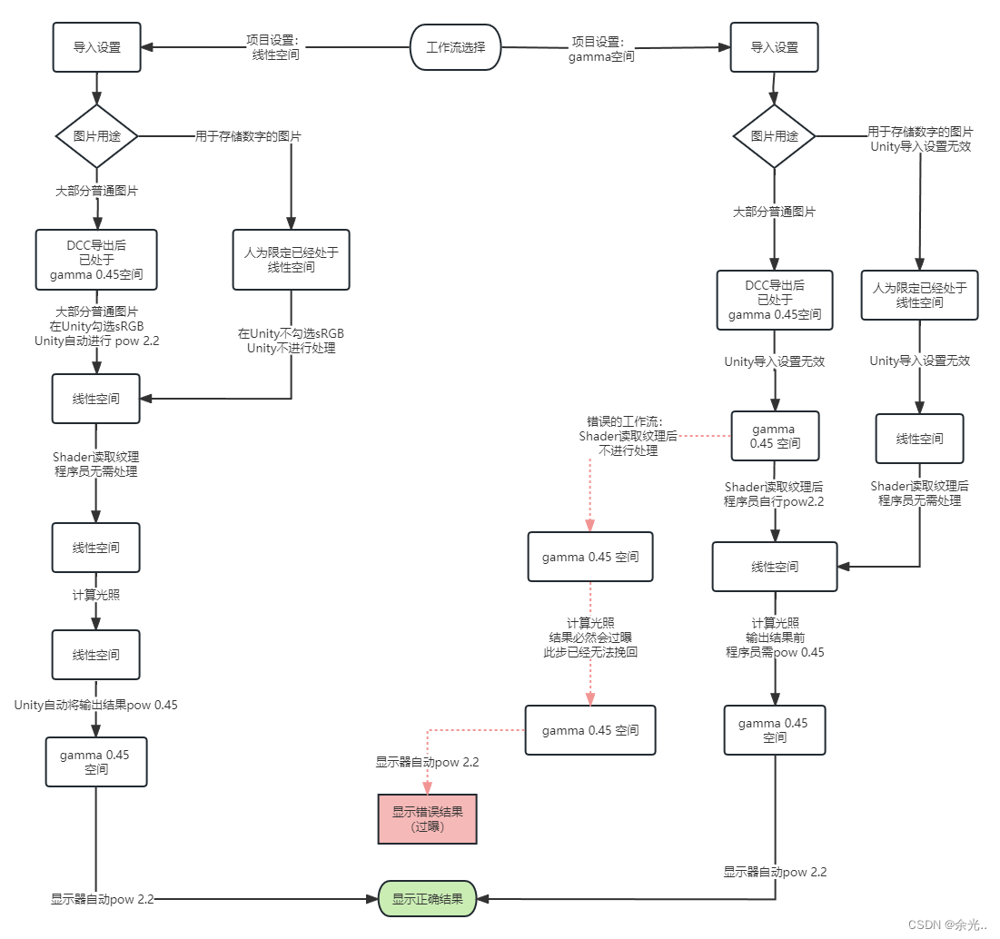

# 线性空间与Gamma空间

> 前提中的前提：
>
> 1. 我们希望显示器显示出来的，是一个线性的变化（真实的光照现象是线性的）
> 2. 线性意味着可以正常的加减乘除，符合运算律，因此在进行关照计算的时候，默认假设都是假设RGB处于线性空间下。

## 0. 历史

古早的Gamma空间是来自于CRT显示器。CRT显示器由于硬件限制，导致其电压与物理显示效果不成正比，电压越大，其亮度变化会越来越剧烈，是一个指数变化（下图蓝色线）

但是我们显然希望显示在显示器上的图像，是符合线性变换的，因此先贤们采取的方法是对图像本身进行处理，也就是给图像施加一个反函数，这样在函数的作用下，图像显示出来的效果（在CRT上）最后是中间那条线性的线。

为了处理这种现象而出现的图片存储格式叫做sRGB

## 1.现在

随着硬件显示器的发展，CRT的问题已经不存在了，但是sRGB已经用了许多年，很多软件也都符合这种规范。因此，新的问题出现了，明明硬件不存在显示问题，但是存储却是按照反函数存储的。并且，光照计算是需要RGB处于线性空间下的，因此现在显示器就自动又模拟了一个CRT的模式，它会自动的加一个蓝色部分的矫正。

所以，我们还是需要一层矫正：

因此，Gamma空间的处理模式是：

sRGB（Gamma空间（绿色部分））-> 光照计算（线性空间） -> FrameBuffer等待显示器输出（回到Gamma空间（绿色部分））->显示器显示矫正（施加蓝色部分，最后显示显示的是红色部分）

## 2. 新的拓展

人眼的物理特性误打误撞，人眼对于深色光照强度低的部分的视觉捕捉更加敏锐，而对于亮色的捕捉反而不敏感。因此可以通过非线性存储的方式，提高暗部存储的细节。

这时候我们再去观察sRGB的存储（绿色线条）就会发现，图像在亮度低的部分变化更敏感，存储了更多细节，而在亮部变化则更加迟钝，可以少存储点。

所以sRGB的这种反Gamma的存储，恰好符合了人眼的特性，也因此也有其意义，而不是单纯的历史包袱

## 3. Unity下的Gamma

unity在贴图的导入设置面板中有“**sRGB(Color Texture)**”选项，勾选它，告诉Unity这是一张**sRGB贴图**，需要对它做sRGB解码才可以获得用于光照计算的数据；不勾选，即表示这是一张**线性贴图**，这张贴图的RGB数据可直接用于光照计算。

https://blog.csdn.net/qq_65461674/article/details/139601547

https://zhuanlan.zhihu.com/p/697308084

https://www.bilibili.com/video/BV1Xs4y1m7iv/?spm_id_from=333.337.search-card.all.click&vd_source=5d4070cc138983fa1babce80b5a31622

一般来说，对于法线贴图，凹凸贴图这些，只是通过贴图来存储一些和显示无关的数据的时候，是不应该该勾选sRGB选项的，因为这些数据是不存在所谓的视觉偏移的。

而对于一些用于视觉采样，颜色采样的贴图来说，一般给的都是Gamma空间的图（因为美术给出来的图，大部分都是Gamma空间的，因为他们也是人眼做出来的图，软件也会把更多的空间给暗部）

Unity项目的线性空间设置，是说，关照计算在什么空间下。正常就应该在线性空间下