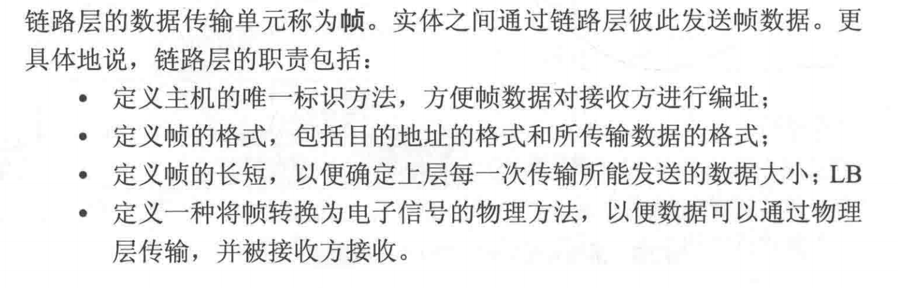
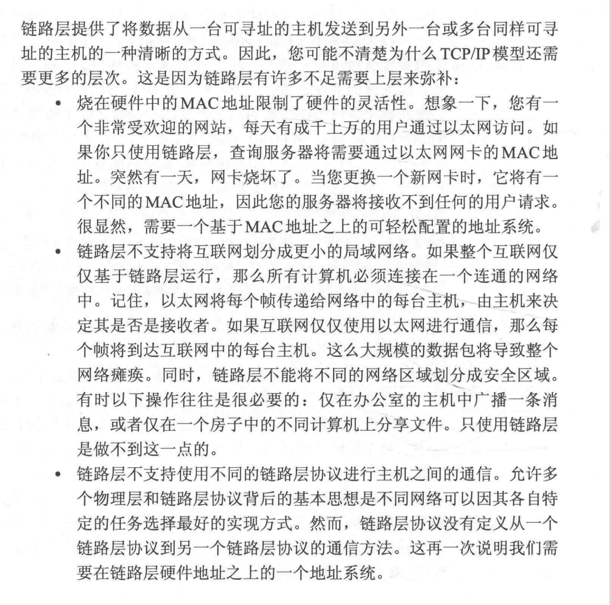
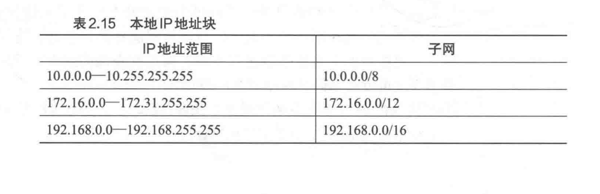

# 分层

1. 物理层

2. 数据链路层

   我们可以这样理解数据链路层，对于数据，我们需要一些约定，才能使得物理的传输是有意义的

   

3. 网络层：实际上是一套逻辑地址系统

不可靠：不保证到达和顺序

4. 传输层
5. 应用层

应用层的一些协议：

NAT，网络地址转换，意思就是说，网络的ipv4地址数目是有限度的，但是一直有特比特别多的网络设备接入网络，首先就是ip不i够用，其次是，按照ip的申请，那么每有一个新的设备接入网络就要去申请一个新的ip地址

有一个方法就是NAT，就是，给子网当中的每台主机分配一个本地可路由的ip地址，保证这些本地的地址不会作为公开ip配分，然后这些子网的路由器是有公开ip地址的，这样相当于多建立了一层缓冲

然后呢，路由器在往外转发东西的时候，会重写数据报的一些信息，来让目标的地址知道是要返回到哪个子网，并且会记录端口号之类的

这样有个问题，就是在网路游戏中，两个子网内的local ip地址，可能彼此不知道是啥