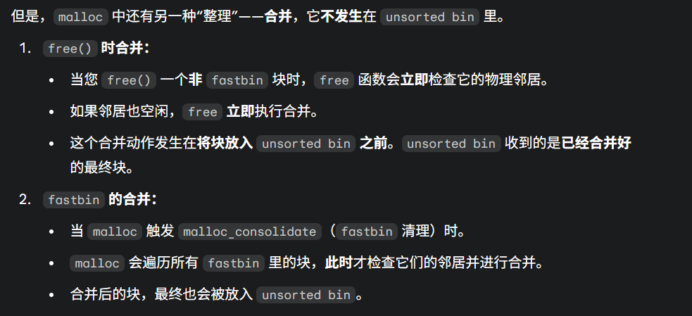
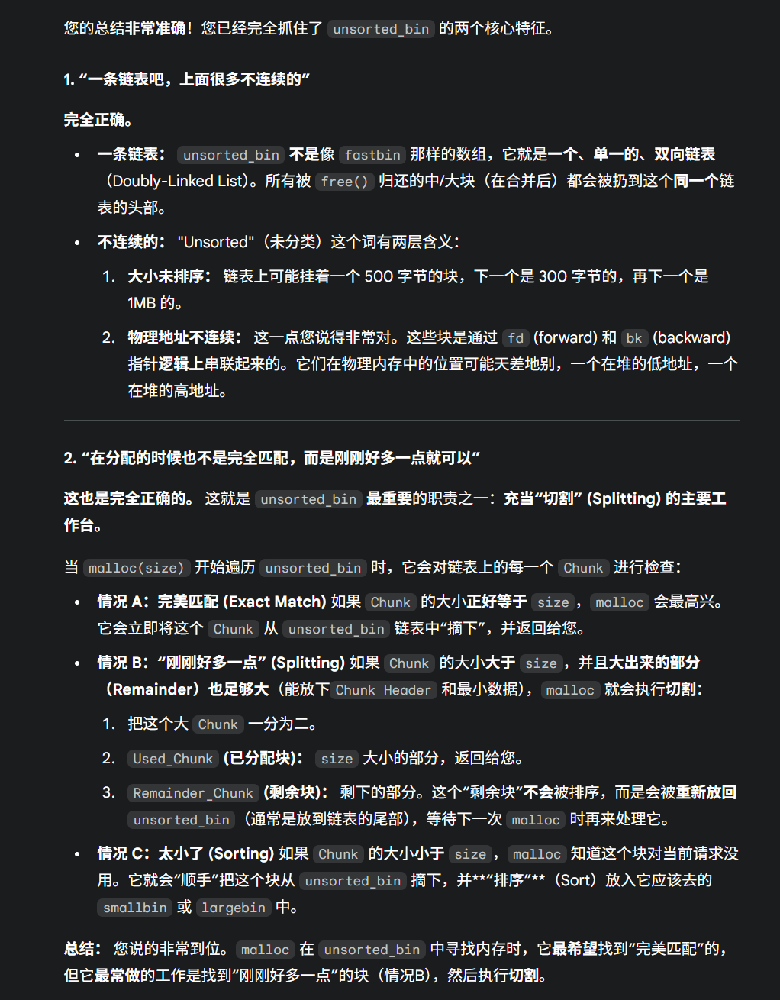
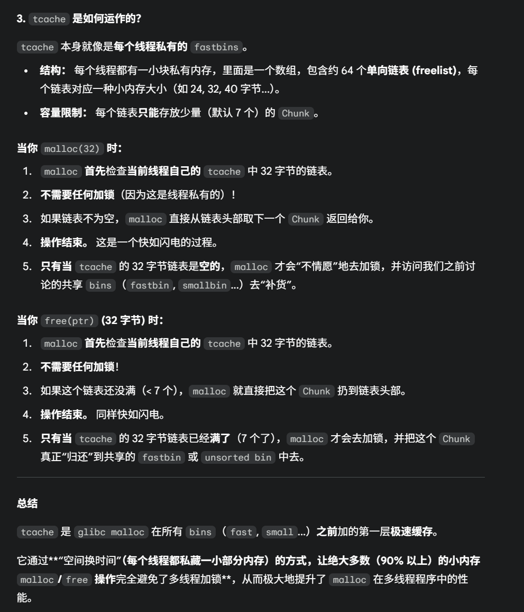
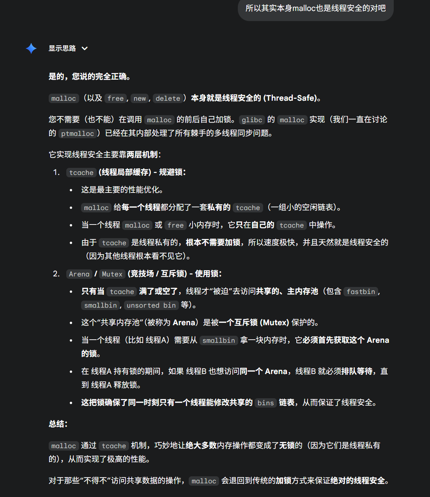
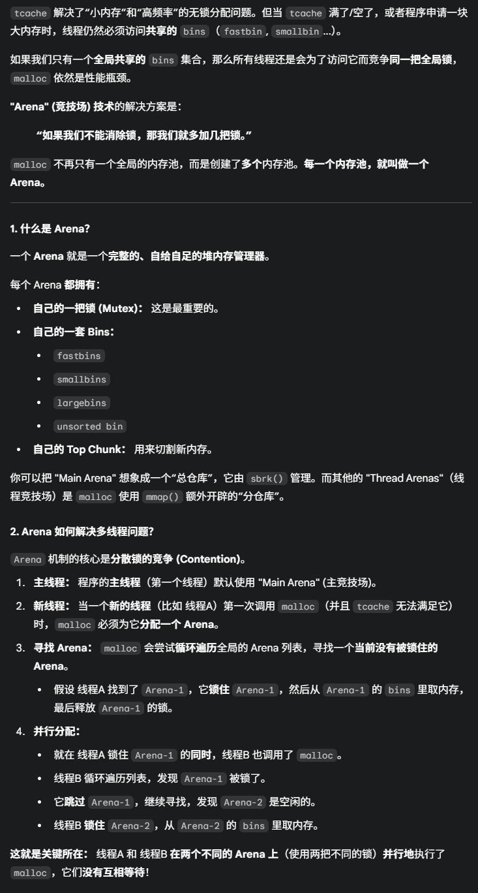
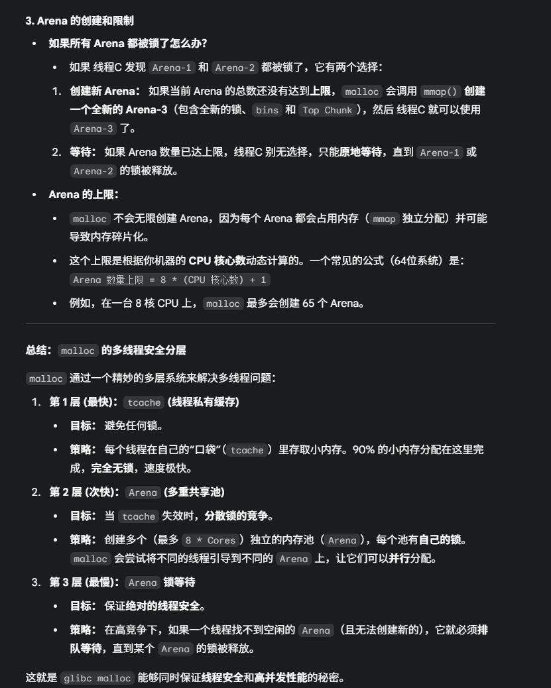
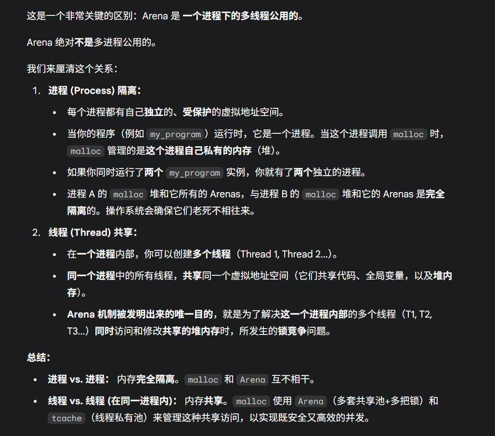
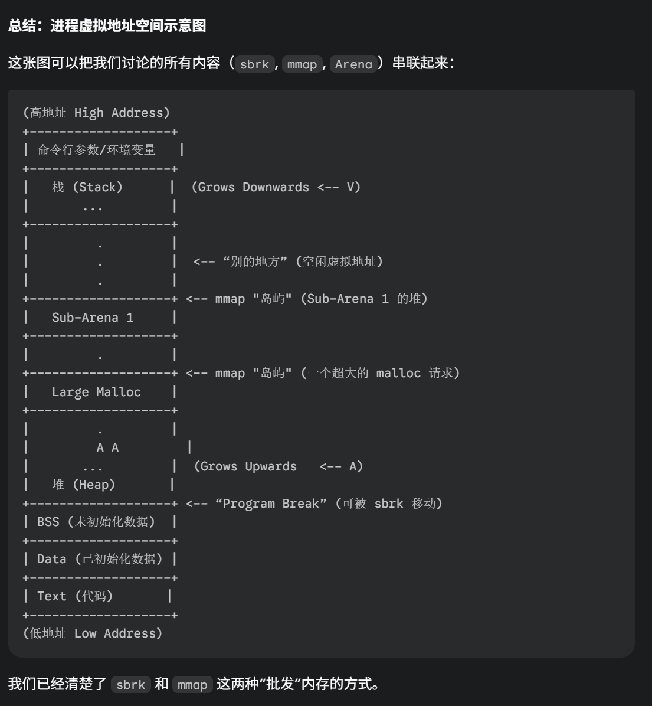
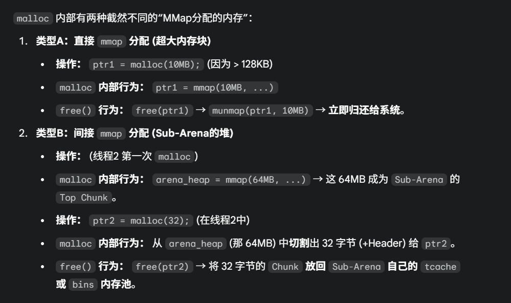

# Malloc

https://jacktang816.github.io/post/mallocandfree/

当我们调用malloc申请一段堆内存的时候，行为会分成两部分：

1. 如果申请的内存比较大（通常是大于128KB），那么会调用mmap这个syscall。这个syscall会在虚拟内存上申请一段虚拟内存映射。这时候实际上还没分配内存，是当这段内存被使用的时候，才会触发缺页中断然后分配**一页的内存**，如果申请的大小大于一页，那么跨页的时候还会继续触发缺页中断
2. 如果申请的内存小于128KB，那么就比较复杂了。下面一点点说

## 小于128KB

### sbrk

malloc终究是需要通过一个方法从操作系统中拿到内存的，这个方法就是sbrk系统调用，准确来说，就是通过移动heap的指针来进行的。

操作系统预分配的heap空间，和stack一样，是通过两个指针确定大小的。因此想要分配，就通过移动brk指针就可以得到。

## 内存池Ⅰ

但是sbrk，mmap都是syscall。如果每次调用malloc都要调用syscall，那这个开销就实在太大了。

因此malloc使用了内存池技术。

比如我们这样一行代码：

```c++
malloc(100);
```

我们申请了100KB大小的堆内存，这时候malloc可能从heap上会直接拿到1M大小的内存，并且使用内存池管理起来，然后分配

## Chunk

从Heap上通过sbrk或者mmap拿到的内存，是一段未经初始化的内存，相当于没有任何数据结构管理的一段未定义memory。

为了管理这段内存，malloc会首先通过一定的初始化约定，让它拥有一个数据结构。这段经过数据结构处理之后的内存就是一个chunk

一个 `Chunk` 的结构（以 `glibc` 的 `ptmalloc` 为例）大致如下。

```c++
	  +-----------------------------------------+
      | (前一个 Chunk 的 User Data)             |
      +-----------------------------------------+  <- prev_chunk 的结尾
      | prev_size (如果前一个 Chunk 是空闲的)    |
(A)   +-----------------------------------------+  <- 当前 Chunk (this_chunk) 的开始
      | size (当前 Chunk 的大小)  |A|M|P|       |
(B)   +-----------------------------------------+  <- ptr = malloc() 返回的指针
      |                                         |
      | User Data (用户可用的内存区域)           |
      | (这块区域在 Chunk 空闲时,                |
      |  会被用来存放 fd 和 bk 指针)              |
      |                                         |
(C)   +-----------------------------------------+  <- 下一个 Chunk (next_chunk) 的开始
      | next_chunk.prev_size (即 this_chunk.size)|
      +-----------------------------------------+
      | next_chunk.size         |A|M|P|       |
      +-----------------------------------------+
```

我们通过malloc拿到的所有的内存，最后都是这样的一个chunk

```c++
void* ptr = malloc(100)
```

并且，我们拿到的这个ptr，实际上是指向UserData部分开头的，而不是直接指向chunk开头的，也就是ptr指向的是(B)的位置

### Header

**Size (大小字段):** userData前面的（A）到（B）的部分，被称为Header。Header当中是size字段是最重要的字段，它存储了**当前 `Chunk` 的总大小**（包括 Header 和 User Data）

**Flags (标志位):** 因为malloc保证Chunk总是8或者16字节对齐的，因此size的低位永远是0。因此这几个低位被利用起来作为标志位。

> **`P` (PREV_INUSE):** **极其重要**。这个标志位为 `1` 时，表示**前一个 `Chunk` (物理相邻) 正在被使用**。如果为 `0`，表示前一个是空闲的。
>
> **`M` (IS_MMAPPED):** 为 `1` 时，表示这个 `Chunk` 是通过 `mmap` 分配的（大内存块），而不是在 `sbrk` 的堆上。
>
> **`A` (NON_MAIN_ARENA):** 表示这个 `Chunk` 是否属于主线程的“内存分配区”(Arena)。

### UserData

这就是 `malloc` 返回给指针 `ptr` 所指向的区域。用户可以自由地读写这块内存。`malloc` 保证 `ptr` 指向的地址是**内存对齐**的（例如16字节对齐）。

### 当 `Chunk` 是空闲时 (Free Chunk)

当调用 `free(ptr)` 后，这个 `Chunk` 就“空闲”了。它的结构会**发生变化**，`User Data` 区域会被“征用”。

- **Header (头部元数据) - (A 到 B 之间)**
  - **`prev_size` (前一块的大小):** **这个字段现在变得有意义了**。它存储了**前一个 `Chunk` (物理相邻) 的大小**。
    - *为什么？* 这是为了实现**合并 (Coalescing)**。当 `free(ptr)` 时，`malloc` 会检查 `P` 标志位。如果 `P` 为 `0`（表示前一个块 `prev_chunk` 是空闲的），`malloc` 就能通过 `ptr` 向前偏移 `prev_size` 的距离，**准确定位到 `prev_chunk` 的头部**，然后将两个空闲块合并成一个更大的空闲块。
  - **`size` (大小字段):** 不变，仍然是当前 `Chunk` 的总大小。
  - **Flags (标志位):** `P` 标志位**会被清除 (设为0)**。这样，**下一个 `Chunk`** (`next_chunk`) 就知道“我前面 (`this_chunk`) 现在是空闲的了”。
- **Repurposed User Data (被征用的用户数据区) - (B 到 C 之间)**
  - 这块内存对用户已经没有意义了，所以 `malloc` 用它来存放**空闲链表 (freelist)** 的指针，以便把这个 `Chunk` 挂到 `bins`（箱子）里。
  - **`fd` (Forward Pointer):** 指向**同一个 `bin`** 中的**下一个**空闲 `Chunk`。
  - **`bk` (Backward Pointer):** 指向**同一个 `bin`** 中的**上一个**空闲 `Chunk`。
  - （对于 `fastbins`，它是一个单向链表，所以通常只使用 `fd`）。
  - 这部分是使用Union达到这个效果的

### 注意

要注意，上面说的preChunk，指的是物理上连续的前一个chunk。在下面要说的内存池管理之后，chunk之前可能在逻辑上会被不同的freelist或者bins的槽位管理起来，也即他们逻辑上可能不连续。但是这里的preChunk指的依然是前一个物理上连续的chunk的情况。

也只有这样，pre的信息才能用于空闲块的合并

## 内存池Ⅱ

### bins


内存池保存在bins这个长128的数组中，每个元素都是一双向个链表。

- bins[0]目前没有使用
- bins[1]的链表称为unsorted_list，用于维护free释放的chunk。
- bins[2,63)的区间称为small_bins，用于维护＜512字节的内存块，其中每个元素对应的链表中的chunk大小相同，均为index*8。
- bins[64,127)称为large_bins，用于维护>512字节的内存块，每个元素对应的链表中的chunk大小不同，index越大，链表中chunk的内存大小相差越大，例如: 下标为64的chunk大小介于[512, 512+64)，下标为95的chunk大小介于[2k+1,2k+512)。同一条链表上的chunk，按照从小到大的顺序排列。

malloc将内存分成了大小不同的chunk，然后通过bins来组织起来。malloc将相似大小的chunk（图中可以看出同一链表上的chunk大小差不多）用双向链表链接起来，这样一个链表被称为一个bin。malloc一共维护了128个bin，并使用一个数组来存储这些bin。数组中第一个为**unsorted bin**，数组编号前2到前64的bin为**small bins**，同一个small bin中的chunk具有相同的大小，两个相邻的small bin中的chunk大小相差8bytes。small bins后面的bin被称作**large bins**。large bins中的每一个bin分别包含了一个给定范围内的chunk，其中的chunk按大小序排列。large bin的每个bin相差64字节。

malloc除了有unsorted bin，small bin，large bin三个bin之外，还有一个**fast bin**。一般的情况是，程序在运行时会经常需要申请和释放一些较小的内存空间。当分配器合并了相邻的几个小的 chunk 之后，也许马上就会有另一个小块内存的请求，这样分配器又需要从大的空闲内存中切分出一块，这样无疑是比较低效的，故而，malloc 中在分配过程中引入了 fast bins，不大于 max_fast(默认值为 64B)的 chunk 被释放后，首先会被放到 fast bins中，fast bins 中的 chunk 并不改变它的使用标志 P。这样也就无法将它们合并，当需要给用户分配的 chunk 小于或等于 max_fast 时，malloc 首先会在 fast bins 中查找相应的空闲块，然后才会去查找 bins 中的空闲 chunk。在某个特定的时候，malloc 会遍历 fast bins 中的 chunk，将相邻的空闲 chunk 进行合并，并将合并后的 chunk 加入 unsorted bin 中，然后再将 unsorted bin 里的 chunk 加入 bins 中。

#### `malloc()` 的获取逻辑：如何切割内存？

当调用 `malloc(size)` 时，`malloc` 会按照一个**严格的搜索顺序**来寻找内存。**“切割 (Splitting)”只在特定的 `bin` 中发生**。

> `malloc` 会按顺序（`tcache` → `fastbin` → `smallbin` → `unsorted bin` → `largebin`）查找空闲块

##### 搜索顺序与切割策略

**第1步：`fastbins` (快表)**

- **检查：** `malloc` 检查请求的 `size` 是否落在 `fastbin` 的精确范围内（例如，请求40字节）。
- **动作：** 如果 40 字节的 `fastbin` 链表不为空，`malloc` 会**直接摘下**头部的 `Chunk` 并返回。
- **切割？** **否。*`fastbins` 总是**精确匹配**。你请求40字节，就必须从40字节的 `bin` 里拿。如果40字节的 `bin` 是空的，就算48字节的 `bin` 是满的，`malloc` 也不会去碰它。

**第2步：`smallbins` (小表)**

- **检查：** 如果在 `fastbins` 中找不到（或者 `size` 超出了 `fastbin` 的范围），`malloc` 会检查 `size` 是否落在 `smallbin` 的精确范围内（例如，请求100字节）。
- **动作：** `malloc` **直接定位**到 100 字节的 `smallbin` 链表。如果链表不为空，`malloc` 会摘下一个 `Chunk` 并返回。
- **切割？** **否。** `smallbins` 和 `fastbins` 一样，也是**精确匹配**。

> **关键转折点：** 如果在 `fastbins` 和 `smallbins` 中都找不到精确匹配的块（或者请求的大小本来就不属于它们的范围），`malloc` 才会开始处理 `unsorted bin`。

**第3步：`unsorted bin` (未分类表) —— 第一次切割点**

- **检查：** `malloc` 开始**遍历 `unsorted bin`** 中的所有 `Chunk`。这是 `malloc` **整理内存**的开始。
- **动作（遍历时）：** 对于 `unsorted bin` 中的**每一个** `Chunk`：
  - **情况 A (精确匹配)：** 如果这个 `Chunk` 的大小 == `size`，太好了！`malloc` 将其摘下并返回。
  - **情况 B (尺寸过大 - 切割！)：** 如果这个 `Chunk` 的大小 > `size`（且足够大到能切割），**切割操作在这里发生！**
    1. `malloc` 将这个大 `Chunk` **一分为二**。
    2. 第一部分（`Used Chunk`）：大小为 `size`，被标记为“已使用”，并**返回给用户**。
    3. 第二部分（`Remainder Chunk`）：剩下的部分。这个“剩余块”**不会被放回 `unsorted bin`**，而是被**插入到它现在应该属于的 `bin` 中**（通常是 `smallbins` 或 `largebins`，或者是 `unsorted bin` 的尾部，取决于实现细节）。
  - **情况 C (尺寸过小)：** 如果这个 `Chunk` 的大小 < `size`。
    1. `malloc` 知道这个块不适合当前请求。
    2. `malloc` 就会“顺手”把这个块从 `unsorted bin` 中摘下，并**排序**放入它**最终归属的 `bin`**（即对应的 `smallbin` 或 `largebin`）。
- **遍历结果：** 当 `malloc` 遍历完 `unsorted bin` 后，它要么已经找到了内存（通过情况A或B），要么就已经把 `unsorted bin` **清空**，并将所有块都**排序**放入了 `smallbins` 和 `largebins`。

**第4步：`largebins` (大表) —— 第二次切割点**

- **检查：** 如果 `malloc` 在 `unsorted bin` 中也没有找到合适的块，它现在就会去搜索 `largebins`（因为 `smallbins` 在第2步已经查过了，并且在第3步C中被填充了）。
- **动作：**
  1. `largebins` 是按**大小范围**组织的，并且**内部按大小排序**（通常从大到小）。
  2. `malloc` 会找到能容纳 `size` 的**最小的那个 `bin`**（例如，请求 1.5MB，它会去找 “1MB-2MB” 的 `bin`）。
  3. 它从该 `bin` 的链表中找到一个“最佳”的 `Chunk`（例如，一个 1.8MB 的块）。
  4. **切割操作再次发生！**
     - 第一部分（`Used Chunk`）：大小为 1.5MB，**返回给用户**。
     - 第二部分（`Remainder Chunk`）：剩下的 0.3MB。这个“剩余块”会被**重新插入**到正确的 `bin` 中（可能会被扔回 `unsorted bin`，等待下一次 `malloc` 循环来处理它）。

**第5步：`Top Chunk` (堆顶块) —— 最终切割点**

- **检查：** 如果**所有 `bins`**（`fast`, `small`, `unsorted`, `large`）都不能满足请求。
- **动作：** `malloc` 只能向“未开发的荒地”——即 `Top Chunk`（堆内存的最高处）——要内存了。
- **切割？** **是。**
  1. `malloc` 从 `Top Chunk` 的底部**切割**出 `size` 大小的内存，并返回给用户。
  2. `Top Chunk` 的起始地址和大小会相应更新（它变小了）。
  3. （如果 `Top Chunk` 连 `size` 都不够，`malloc` 就会调用 `sbrk()` 向操作系统要更多的内存，扩大 `Top Chunk`，然后再进行切割。）

> ###### **TopChunk是啥时候分配的：**
>
> 
>
> 
>
> ###### **假设我现在第一次用malloc，malloc拿到了一块TopChunk，那么这时候假设我申请的是1KB的内存，那么这时候是如何分配回去1KB的呢**
>
> 

#### free

> `free()` 一个**小块** -> **第一去向是 `fastbin`**。
>
> `free()` 一个**中/大块** -> **第一去向是 `unsorted bin`**。

##### `fastbins` (快表)

`fastbins` 是一个**数组** (array)，这个数组的**每一个“槽位” (index) 都是一个<u>独立的</u>链表头部**。所以查找是一个O(1)的操作

- **适用情况：** **非常小**的内存块（例如，在64位系统上，小于80字节的块）。
- **管理方式：**
  1. `malloc` 检查到这是一个“小块”。
  2. 它**不会**检查这个块的物理邻居（即**不会进行合并**）。
  3. 它**直接**将这个 `Chunk` 放入对应大小的 `fastbin` 链表的**头部**。
- **设计哲学：** **速度就是一切**。`free` 操作几乎瞬间完成。
- **代价：** 因为不合并，`fastbins` 会持有大量不连续的小碎片，**增加外部碎片**的风险。

> #### `fastbin` 的块什么时候才会进入 `small/large bins`？
>
> 它们**永远不会直接**进入 `small/large bins`。

##### unsorted bin` (未分类表)

- **适用情况：** **所有不属于 `fastbin` 大小**的内存块（即中等大小和大的内存块）。

- **管理方式：**

  1. `malloc` 检查到这是一个“中/大块”。
  2. **立即执行合并 (Coalescing)**：`malloc` 会利用 `P` 标志位和 `prev_size` 头部信息，检查**物理上相邻的前后 `Chunk`** 是否也是空闲的。
  3. 如果邻居空闲，它会**立即将它们合并**成一个**尽可能大**的连续空闲块。
  4. 最后，这个**合并后**的（也可能是未合并的，如果邻居都在使用中）大 `Chunk`，被放入 **`unsorted bin`**（这是一个单一的双向链表）的头部。

- **设计哲学：** **“延迟排序”** 和 **“重用缓存”**。

- **为什么不直接放入 `smallbin` 或 `largebin`？** `unsorted bin` 充当一个“中转站”。`malloc` 猜测：**“你刚刚释放的这块内存，很可能马上又会需要。”** 把它放在一个单独的、易于访问的地方，比立刻对它进行排序要快。

  > 那么什么时候unsortedBins里的内存块会被放到small和fastbin当中呢？
  >
  > **下次 `malloc(size)` 时：**
  >
  > 1. `malloc` 在 `fastbin/smallbin` 中找不到精确匹配。
  > 2. 它开始**遍历 `unsorted bin`** 来寻找内存。
  > 3. **这就是“补充”发生的地方！** 当 `malloc` 遍历 `unsorted bin` 里的块时，如果发现一个块**太小了**，不满足当前的 `malloc(size)` 请求...
  > 4. `malloc` 就会“顺手”把这个太小的块从 `unsorted bin` 中取出，并**插入**到它应该去的**正确的 `smallbin` 或 `largebin` 链表**中。

#### 何时合并何时分割

> 1. `unsorted bin` 是“排序归类”**唯一发生的地方**（在 `malloc` 时触发）。
>
>    `unsorted bin` 是“合并”操作的**目的地**（在 `free` 时或 `fastbin` 清理时触发）。
>
> 2. 内存chunk的合并整理（Coalescing）
>
>    
>
> 3. **排序归类 (Sorting)：** 把空闲块放进它们**所属的** `smallbin` 或 `largebin`。这个过程只会在malloc的时候进行，只会发生在Unsorted_bins
>
> 
>
> unsorted_bin是一条链表，上面很多不连续的,大小未排序的chunk。并且unsorted_bin在分配的时候也不是完全匹配，而是刚刚好多一点就可以
>
> 

`free()` (放回) 的管理逻辑：

- **`fastbins`：** 速度优先。**不合并**，直接放入对应 `bin` 的头部。
- **其他所有 `bins`：** 碎片整理优先。**先合并**物理邻居，然后**统一扔进 `unsorted bin`** 作为中转站。

`malloc()` (获取) 的切割逻辑：

- **`fastbins` / `smallbins`：** **绝不切割**。只提供精确匹配。
- **`unsorted bin`：** **会切割**。在遍历时，如果找到一个比需求大的块，就地切割。
- **`largebins`：** **会切割**。在找到一个合适的（通常是“最佳适配”）大块后，进行切割。
- **`Top Chunk`：** **会切割**。这是最后的内存来源，按需切割。

### 内存池多线程

实际上，内存池分为两部分：

线程局部缓存和多个共享内存池（Arena）

#### 1. tcache

上面的malloc的这些操作是要加锁的。因此如果多线程malloc是比较耗时的，要等待。因此现代malloc加了 Thread-Local Cache (线程局部缓存)也就是tcache

所以实际上，malloc的时候，会最先查找的是：tcache

`tcache` 是一个**极其简单粗暴且高效**的解决方案：

**`glibc malloc` 决定给<u>每一个线程</u>都分配一套<u>私有的</u>空闲内存池 (freelist)。**

> `malloc` 会按顺序（`tcache` → `fastbin` → `smallbin` → `unsorted bin` → `largebin`）查找空闲块






#### 2. Arena





> 这个Arena是多进程公用的吗，还是一个进程下的多线程公用的
>
> 
>
> Arena的是在进程第一次创建的时候就已经分配好了多少个子Arena了吗
>
> 
>
> Main Arena的逻辑我没看懂，Arena不都是用bins管理的吗，为什么说MainArena是用sBrk管理的？意思是主线程的malloc每次都要用syscall而不是用内存池吗
>
> 

## SBRK和MMap

存在两种堆内存：

1. 存在于系统分配的进程空间当中，由start_brk和brk指针框定了一个范围。用sbrk的时候，实际上是在移动topHeap的start_brk指针向下。所以这样分配的是一直连续的
2. 第二种是使用mmap，从系统别的地方挖出来的




### Free何时归还内存

我看malloc这样，它free之后的内存好像一直都没有归还给系统？


mmap分配的内存，在free的时候，不会插入到内存池当中，而是直接还给系统了

子Arena**用来管理**的**那块大内存（堆）**，是通过 `mmap` **一次性批发**来的。

所以是只有MMap分配的内存才会直接还给系统




注意TopChunk的扩充和mallioc一个特别大的内存，不是一件事情

这里说的是，对于MainArena也就是主线程来说，它的TopChunk枯竭了，再次分配的时候走的是SBRK。而SubArena走的是MMap

但是对于malloc一个很大的内存来说，无论是MainArena还是SubArena都是走的MMap

## Cache一致性

