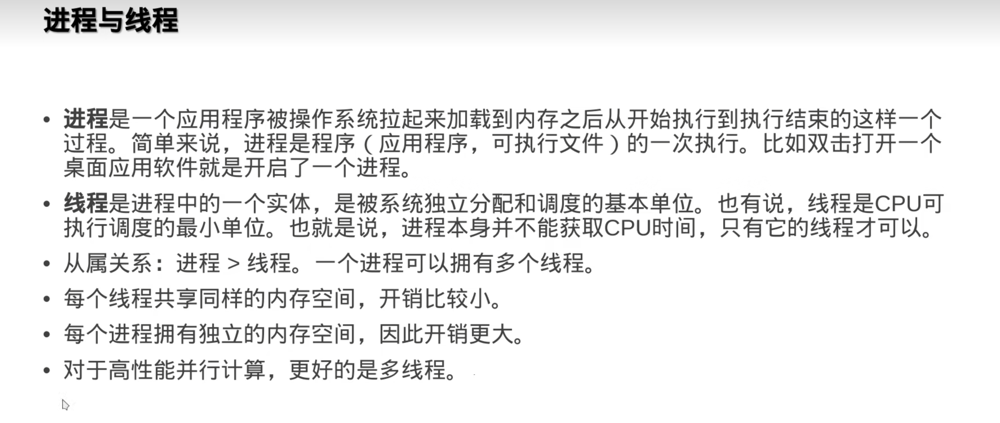
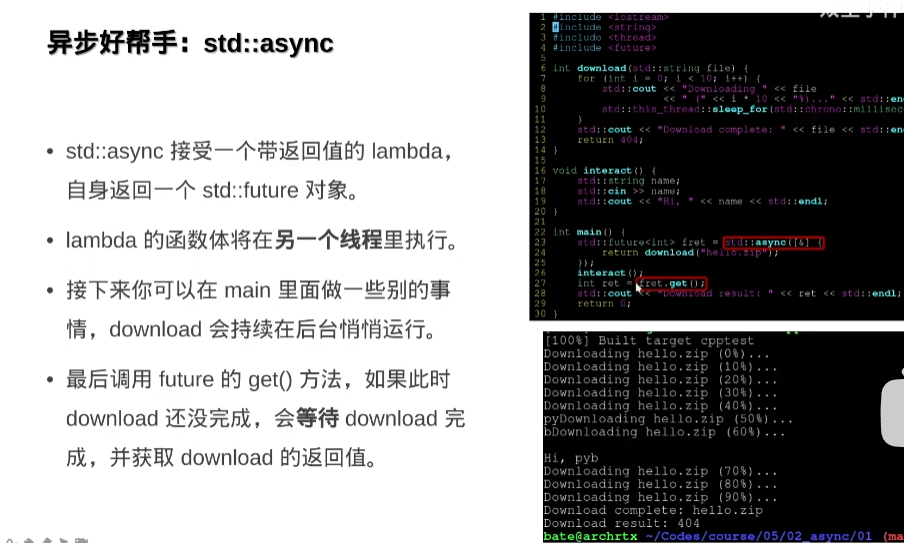
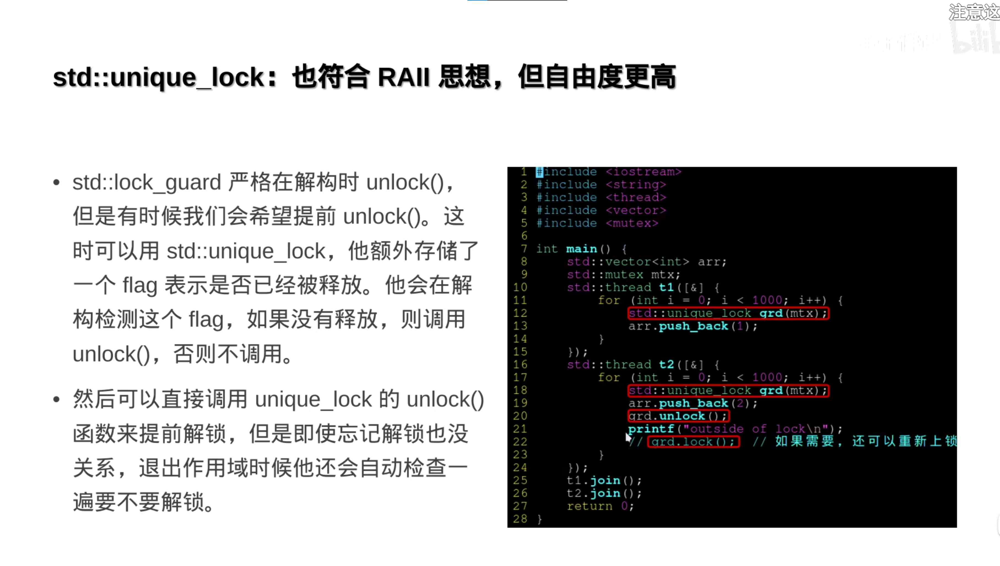
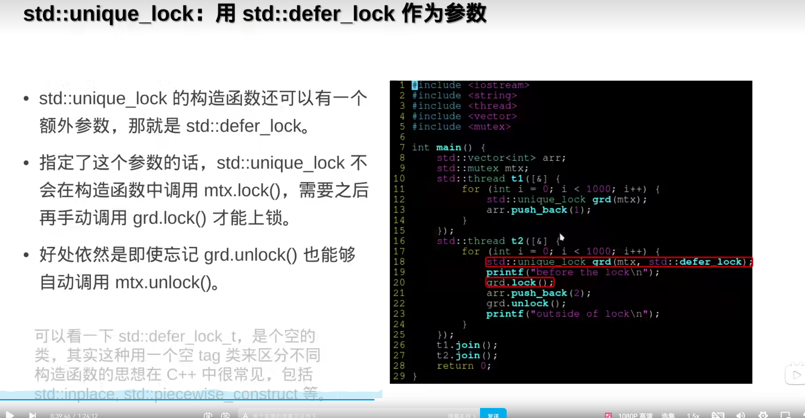
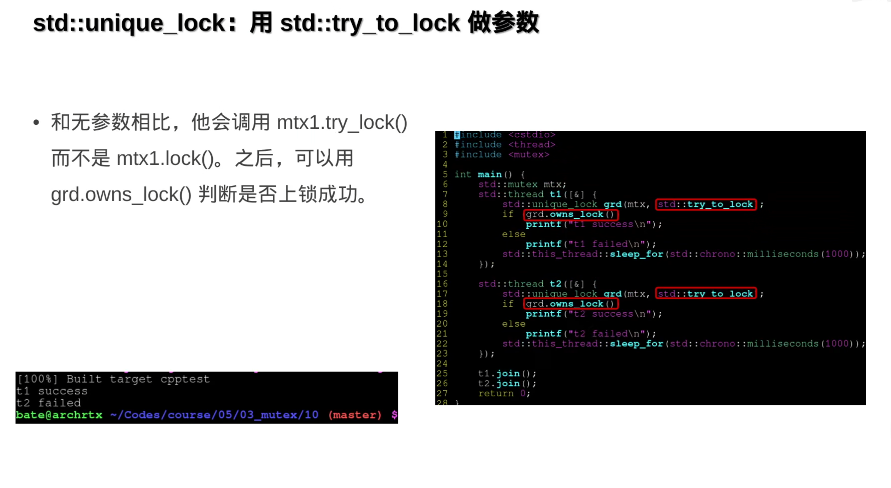
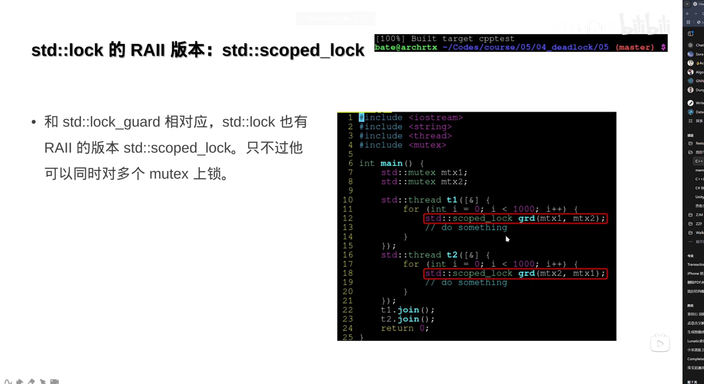
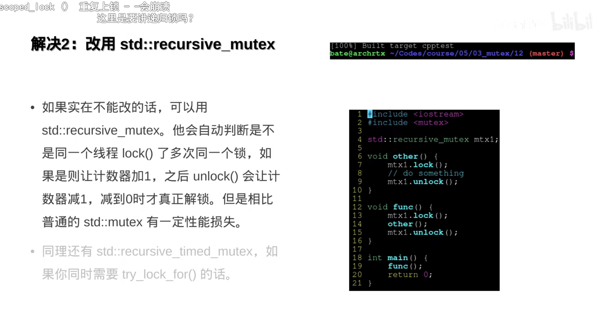
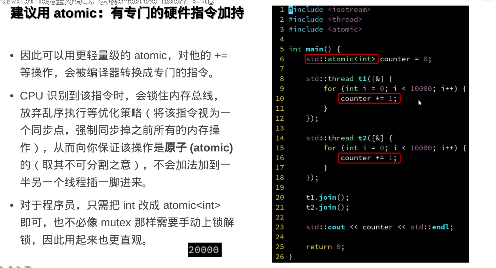
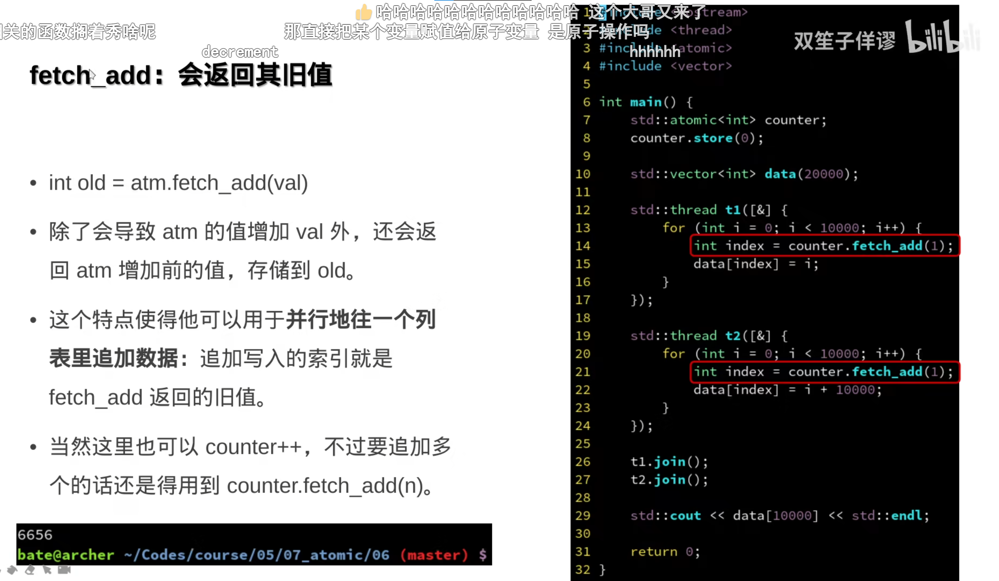

5.进程之间的通信方式有哪些

6.C++如何实现多线程同步


 C++中如何使用std::condition_variable进行线程同步？





RAII的思想充满了整个C++多线程


## 时间：

std::chrono统一了混乱的时间单位

## 多线程

std::thread创建一个线程，执行对应传入的函数对象

thread.join用来同步，等待一个线程执行完毕

thread.detach。由于thread是个对象，因此，thread对象析构的时候会自动终止对应的函数（线程），因此可能会导致在函数内开启的线程无法正确在离开函数后执行，因此detach是用来分离thread对象和对应的线程实例的。但是这样可能会无法管理对应的线程实例。因此可以通过std::move转移线程管理权限。

## std::async



## 锁：

mutex很好理解，但是忘记解锁会导致数据无法被再次访问。因此C++提供了std::lock_guard(mtx)，在其析构函数中，自动unlock构造时传入的mutex。

类似于:

```cpp
std::mutex mtx;
{
    std::lock_guard(mtx);
}
```

等价于：

```
std::mutex mtx;
mtx.lock()
xxx
mtx.unlock();
```

但是我们可能希望提前释放锁，可以使用unique_lock，既符合RAII思想，又可以提前释放






trylock和trylockfor



## 死锁

## 两个锁竞争

std::lock（mtx1，mtx2）同时上锁防止死锁



## 同一个线程里对同一个锁重复上锁



读写锁：shared_mutex=》RAII shared_lock

访问者模式

## 条件变量

## 原子操作




