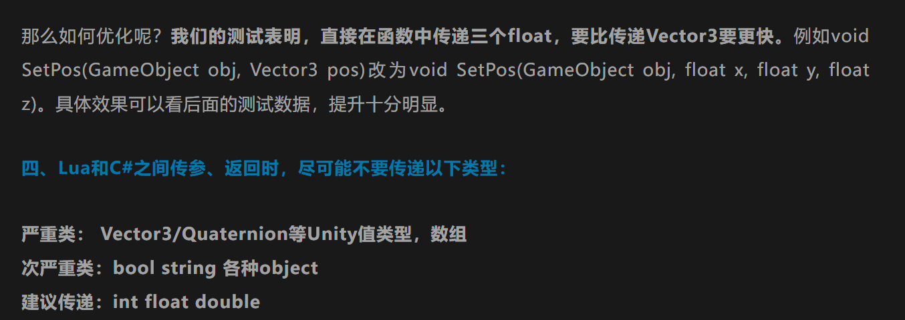
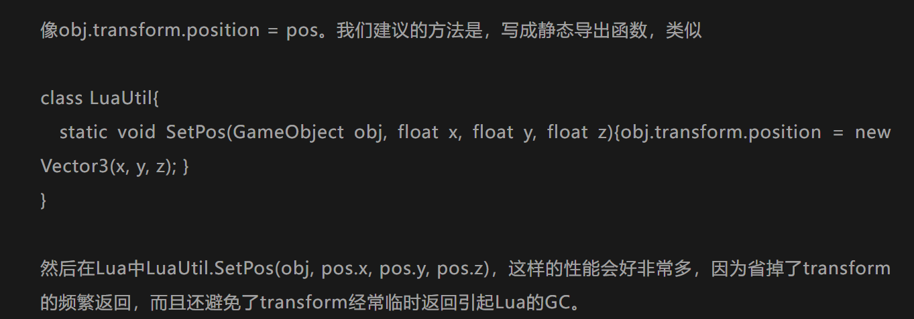

# Lua

## Lua和C通信

通过栈

## Lua闭包：

```c++
typedef struct LClosure {
  ClosureHeader;
  struct Proto *p;       // 指向函数原型
  UpVal *upvals[1];    // 指向 UpVal 对象的指针数组
} LClosure;


typedef struct Proto {
  CommonHeader;
  lu_byte numparams;  /* number of fixed (named) parameters */
  lu_byte flag;
  lu_byte maxstacksize;  /* number of registers needed by this function */
  int sizeupvalues;  /* size of 'upvalues' */
  int sizek;  /* size of 'k' */
  int sizecode;
  int sizelineinfo;
  int sizep;  /* size of 'p' */
  int sizelocvars;
  int sizeabslineinfo;  /* size of 'abslineinfo' */
  int linedefined;  /* debug information  */
  int lastlinedefined;  /* debug information  */
  TValue *k;  /* constants used by the function */
  Instruction *code;  /* opcodes */
  struct Proto **p;  /* functions defined inside the function */
  Upvaldesc *upvalues;  /* upvalue information */
  ls_byte *lineinfo;  /* information about source lines (debug information) */
  AbsLineInfo *abslineinfo;  /* idem */
  LocVar *locvars;  /* information about local variables (debug information) */
  TString  *source;  /* used for debug information */
  GCObject *gclist;
} Proto;


typedef struct UpVal {
  CommonHeader;
  union {
    TValue *p;  /* points to stack or to its own value */
    ptrdiff_t offset;  /* used while the stack is being reallocated */
  } v;
  union {
    struct {  /* (when open) */
      struct UpVal *next;  /* linked list */
      struct UpVal **previous;
    } open;
    TValue value;  /* the value (when closed) */
  } u;
} UpVal;
```


闭包本质上是个函数对象，Lua中函数对象同时保存了函数字节码，运行环境以及其要用到的数据。

### 字节码：

字节码的保存是在proto当中的，

Proto里存储的就是函数的字节码以及他要用到的upValue的信息。运行的时候会根据proto去创建对应的闭包实例，以及链接upvalue

### Upvalue

同时，Lua提供了当找不到需要数据的时候向外查找的能力，也就是Upvalue。

在闭包被构建的时候，外部的local变量会被保存在一个Upvalue里面，而且这个upvalue被链接在一个全局的upvalue链表当中。

在外层的函数未被返回之前，upvalue是open的。这时候upvalue里保存的是指向栈上真正变量存放位置的指针。也因此这时候通过upvalue访问变量是共享的。

而当外层函数返回之后。upvalue变close，并且从全局的链表中脱离。这时候upvalue里存储的是变量的副本。但是同样的，比如在下面的例子中，函数a中定义了b和c两个闭包，当i对应的upvalue为close的时候，b和c这两个闭包依然是可以共享同一个upvalue的。因此修改操作也是同步的。

https://zhuanlan.zhihu.com/p/602644288


https://zhuanlan.zhihu.com/p/494191824

```lua
local test= function ()
    local i=1;
    local function a()
        i=i+10;
        print("a")
        print(i)
    end

    local function b()
        i=i+5;
        print("b")
        print(i)
    end

    a()
    print(i)
    return a,b
end

local a,b=test();
b()
a()
-- b()

a
11
11
b
16
a
26
```


https://zhuanlan.zhihu.com/p/595965132

你提到的解释是对的！确实，Lua 中闭包的实现原理主要是通过 **upvalue**（上值）来实现的，而不仅仅是依赖于可达性分析的垃圾回收（GC）。让我详细解释一下。

### Lua 中闭包的实现：通过 Upvalue

在 Lua 中，**闭包捕获的变量被称为“upvalue”**。upvalue 是指在闭包函数外部定义的、被闭包内部访问的局部变量。闭包通过引用这些局部变量（或外部局部变量的值）来形成对外部环境的访问，即使外部函数已经返回，闭包仍然可以访问它们。

#### **Upvalue 和 闭包的关系：**

- **Upvalue** 是闭包内部捕获的外部局部变量的引用。
- **Upvalue** 会被存储在闭包的执行环境中，即使外部函数的作用域已经结束，这些捕获的局部变量仍然可以被访问。
- 通过这种方式，Lua 允许闭包在执行时继续访问并修改这些捕获的局部变量。

### 例子：Upvalue 的工作方式

```
lua复制编辑function outer()
    local x = 10  -- x 是一个局部变量
    return function()  -- 这个函数是一个闭包
        return x  -- 访问捕获的外部局部变量 x
    end
end

local closure = outer()  -- 返回闭包
print(closure())  -- 输出 10
```

在这个例子中，`closure` 捕获了 `outer` 函数中的 `x` 变量，而 `x` 就是一个 upvalue。即使 `outer` 函数已经执行完毕，闭包仍然能够访问 `x`。

### 闭包与 Upvalue 的关系

每个 Lua 函数内部的变量可以分为两种：

1. **局部变量**：这些变量在函数执行时存在，并在函数调用结束时销毁。闭包无法访问这些局部变量。
2. **Upvalue**：闭包访问的外部局部变量，这些变量会被保存在闭包的执行环境中，直到闭包不再被引用为止。

### 通过 Upvalue 实现闭包的引用 

当 Lua 创建一个闭包时，**Lua 会为捕获的变量（upvalue）创建一个特殊的引用**。这些引用指向原始的局部变量。如果这些局部变量在闭包创建时依然有效，它们会成为 upvalue，并会保持与闭包的生命周期相同，直到闭包本身不再被引用。

### 可达性分析与垃圾回收（GC）

虽然 Lua 的垃圾回收机制主要依赖可达性分析来回收内存，但它与闭包的实现原理是相辅相成的：

- **闭包与 upvalue**：闭包在创建时捕获了局部变量的引用，这些引用（即 upvalue）会在闭包生命周期内保持有效，直到闭包本身被销毁。
- **垃圾回收**：Lua 会通过可达性分析来检查哪些对象是可达的，并进行回收。只要闭包和它的 upvalue 仍然被引用，Lua 就不会回收这些 upvalue。

### 总结

你是对的，Lua 闭包的实现是通过 **upvalue** 来捕获外部局部变量的，而不是直接通过垃圾回收的可达性分析。**Upvalue** 是闭包的一部分，它通过引用局部变量或外部环境的局部变量来实现闭包的功能。Lua 的垃圾回收机制会确保只有不再可达的对象（包括闭包和 upvalue）才会被回收，因此闭包的生命周期由它自身以及捕获的 upvalue 决定。

希望这个解释能帮助你更好地理解 Lua 闭包的实现原理！


##### 您说：

局部变量是在栈上被自动回收的还是通过GC


##### 

**分析内存模型**

我正在回顾局部变量的内存管理，决定是引用计数还是垃圾回收。注意到共享指针适合引用计数，而独立指针更适合垃圾回收。

**了解内存管理**

局部变量通常在函数调用结束时自动回收，但也可以触发垃圾回收机制。有效管理资源的关键是优化性能和避免内存泄漏。

在 Lua 中，**局部变量的回收是通过栈的自动管理和垃圾回收机制共同完成的**。

### 1. **局部变量的存储：**

- **局部变量**是存储在**栈**上的。当一个函数被调用时，局部变量会在栈上分配内存，并在函数返回时自动从栈中移除。
- **局部变量的生命周期与函数调用的生命周期一致**，也就是说，它们会随着函数调用的开始而被创建，随着函数返回而销毁。

### 2. **栈上的自动回收：**

当函数执行完毕，栈上的局部变量会被自动销毁。**Lua 的栈管理**确保在函数退出时，栈中的局部变量会被自动释放。这是一个栈管理的过程，不需要垃圾回收器介入。

### 3. **垃圾回收的作用：**

尽管局部变量本身会在栈上被自动销毁，但如果这些变量是通过闭包（或者其他方式）被引用的，它们的内存不会立即被释放。**垃圾回收器（GC）**会在后续的某个时刻检查这些不再需要的对象，并回收它们。

具体来说：

- 如果局部变量没有被闭包引用或者其他持久化对象引用，它们在函数结束时会被销毁，Lua 会立即释放这些内存，而不需要垃圾回收的介入。
- 如果局部变量通过闭包或者其他机制被引用，它们会在函数返回后仍然保留在内存中，直到垃圾回收器（GC）发现它们不再可达，才会进行回收。

### 例子：栈上的局部变量和垃圾回收

```
lua复制编辑function example()
    local a = 10  -- 局部变量 a
    local b = 20  -- 局部变量 b
    return function()  -- 返回一个闭包
        return a + b  -- 闭包引用了局部变量 a 和 b
    end
end

local closure = example()  -- 创建闭包
print(closure())  -- 输出 30

-- 即使 example 函数执行完毕，局部变量 a 和 b 仍然存在，因为闭包捕获了它们
```

在这个例子中，`a` 和 `b` 是局部变量，虽然它们在 `example` 函数执行完后应该从栈中销毁，但由于闭包引用了它们，它们不会被立即回收，而是依赖于垃圾回收器在后续的时间里回收。

### 总结

- **局部变量**：存储在栈上，它们会随着函数调用的结束自动销毁。
- **垃圾回收**：垃圾回收器主要负责回收那些不再被引用的对象。如果局部变量通过闭包等方式被引用，垃圾回收器会确保它们的内存被正确回收。

所以，对于普通的局部变量，它们的回收主要由栈的自动管理负责，而对于闭包等保存了外部局部变量引用的情况，垃圾回收器会确保不再被引用的变量最终被回收。


##### 您说：

 local a = 10  -- 局部变量 a    local b = 20  -- 局部变量 b是不是就在exmaple函数执行结束之后，就随着出栈而消失了。 而闭包里的a和b则是被捕获在两个upvalue，保存在闭包的执行数据里面


##### 

**探讨局部变量生命周期**

局部变量a和b在函数结束后会消失，而闭包中的a和b则会被捕获住。这样，我开始思考闭包的有效性和持久性。

**探讨局部作用域**

我正在思考局部变量a和b是否在函数执行结束后消失。闭包中捕获了这两个变量，这让我开始关注闭包的作用和生命周期。

**探讨闭包作用**

局部变量a和b在函数结束后消失。闭包捕获了这些变量，继续使用。现在，我看着这个过程，理解闭包的重要性和作用。

**探讨变量捕获**

好奇局部变量a和b是否会在函数结束后消失。闭包却将它们捕获，使得它们能够跨函数作用域保持有效。这个发现让我对闭包的力量感到震惊。

**思考闭包的捕获**

局部变量a和b在函数执行结束后是否会消失。通过闭包被捕获，我们将它们保持在有效状态，跨越了函数的作用域。这个现象很有趣。

**探讨局部变量的生命周期**

我在思考局部变量a和b在函数执行结束后会消失。闭包捕获了这些变量，使它们持续有效。这个过程引发了我对闭包机制的兴趣。

**探索变量持久性**

我正在考察局部变量a和b是否会在函数结束后消失。闭包捕获了这些变量，保证它们跨越函数作用域持续有效。这个现象引发了我对闭包机制的兴趣。

**探讨变量生命周期**

好奇局部变量a和b在函数执行结束后是否会消失。闭包捕获了它们，这样就能保证它们在函数作用域外保持有效。

是的，你理解得完全正确！我将详细说明一下这个过程：

### 局部变量的生命周期

在 Lua 中，局部变量（如 `a` 和 `b`）的生命周期是与函数的执行周期密切相关的。当 `example` 函数开始执行时，局部变量 `a` 和 `b` 会在栈上分配内存；当 `example` 函数执行完毕，局部变量 `a` 和 `b` 会从栈上**出栈**并销毁。这个过程是栈管理自动完成的，不需要垃圾回收器的干预。

### 闭包的捕获机制

当你在 `example` 函数中返回一个闭包时，闭包会**捕获并保存对 `a` 和 `b` 的引用**。这就是 **upvalue**（上值）机制。

- **Upvalue**：闭包会捕获并保存对外部局部变量的引用，这些外部变量（如 `a` 和 `b`）会被封装到闭包的执行环境中，而不是简单地复制它们的值。这样，闭包在执行时仍然能够访问这些局部变量。
- 闭包保存的并不是局部变量本身，而是局部变量的引用（即 upvalue），这使得闭包可以在外部函数执行完毕后仍然使用这些变量。

### 代码示例：

```
lua复制编辑function example()
    local a = 10  -- 局部变量 a
    local b = 20  -- 局部变量 b
    return function()  -- 返回一个闭包
        return a + b  -- 闭包访问局部变量 a 和 b
    end
end

local closure = example()  -- 创建闭包
print(closure())  -- 输出 30

-- 这里 example 函数已经结束，局部变量 a 和 b 已经从栈上销毁，
-- 但是闭包仍然能够访问它们的值，因为它们被捕获为 upvalue
```

### 解释：

- **局部变量 `a` 和 `b`**：当 `example` 函数执行完毕，`a` 和 `b` 将从栈上移除，因为它们是局部变量，生命周期仅限于 `example` 函数的执行范围。
- **闭包**：当你返回的闭包被调用时，它仍然可以访问 `a` 和 `b`，这是因为它们被捕获为闭包的 upvalue，并存储在闭包的执行数据结构中，直到闭包本身不再被引用。

### 总结：

- **局部变量 `a` 和 `b`**：它们在 `example` 函数执行结束后会随着栈的回收而消失。
- **闭包的 upvalue**：闭包保存了对 `a` 和 `b` 的引用，即使 `example` 函数已经结束，它们仍然在闭包的执行数据中存在。闭包通过 upvalue 来“记住”这些外部局部变量。

因此，闭包并不会复制局部变量的值，而是通过引用（upvalue）来保存这些变量，确保即使外部函数的执行环境已经销毁，闭包仍能访问这些变量。


##### 您说：

我看对于upvalue的使用是这样解释的：如果local a和b未离开example作用域时，upvalue保存的是指向栈上的“指针”。然后当离开example作用域的时候，会把a和b拷贝到upvalue里面。


##### 

**解释upvalue的定义**

合理解释upvalue的定义和用法。upvalue用于闭包内存储外部作用域的变量，其引用期用栈指针。```

**关注upvalue引用**

upvalue用于闭包存储外部作用域的变量，其引用期通过栈指针指向变量。离开作用域时，变量被拷贝到upval中。

你理解得有一定道理，尤其是对于**闭包捕获局部变量（upvalue）\**的机制，但我想澄清一下细节，尤其是\**upvalue**的存储和管理方式。

### 闭包与 Upvalue 的工作机制

1. **局部变量的生命周期**：当 `example` 函数开始执行时，局部变量 `a` 和 `b` 存储在栈上。函数执行完成时，这些局部变量会从栈上移除，生命周期结束。
2. **Upvalue 的捕获**：当 `example` 函数返回一个闭包时，这个闭包会捕获函数作用域中的局部变量。**此时，闭包并不是直接拷贝 `a` 和 `b` 的值**，而是通过引用捕获它们。具体来说，闭包会保存一个对局部变量的**引用**，或者说是对局部变量的**指针**。如果局部变量还在栈上，它实际上是捕获了指向栈中这些变量的指针。
3. **离开作用域后的行为**：当 `example` 函数的作用域结束时，`a` 和 `b` 被从栈中移除，但闭包保存了对这些局部变量的引用。如果这些变量被保存在闭包的 upvalue 中，Lua 会把这些局部变量的当前值**拷贝到闭包的执行数据中**，确保闭包能够继续访问它们，而不依赖栈上的局部变量。

### 详细说明：

- **在 `example` 函数执行过程中**，局部变量 `a` 和 `b` 在栈上。此时，闭包内部捕获的是这些局部变量的引用。闭包和这些局部变量之间建立了一种关系——闭包引用了栈上的变量。
- **当 `example` 函数结束并离开作用域时**，局部变量 `a` 和 `b` 已经从栈中移除。闭包仍然能够访问这些变量，因为它们的值已经被“拷贝”到闭包的 upvalue 中（即闭包的执行环境中）。此时，闭包不再依赖栈上的局部变量，而是拥有它们的副本。

### 示例代码：

```
lua复制编辑function example()
    local a = 10  -- 局部变量 a
    local b = 20  -- 局部变量 b
    return function()  -- 返回闭包
        return a + b  -- 闭包访问局部变量 a 和 b
    end
end

local closure = example()  -- 创建闭包
print(closure())  -- 输出 30
```

在这个例子中：

- 在 `example` 函数执行过程中，闭包捕获了局部变量 `a` 和 `b` 的引用。
- 当 `example` 函数返回后，局部变量 `a` 和 `b` 会从栈上移除，闭包通过 upvalue 保留了 `a` 和 `b` 的值。

### 总结：

- **Upvalue 捕获**：闭包捕获局部变量的**引用**，即捕获它们在栈上的位置。
- **作用域结束后的拷贝**：当局部变量离开作用域时，闭包会将这些变量的当前值拷贝到闭包的 upvalue 中，确保闭包可以继续使用这些变量的值，而不依赖栈上的变量。

因此，**你所提到的“拷贝到 upvalue 中”的描述是准确的**，特别是在局部变量超出其作用域后，闭包会把这些变量的值（而不是指针）拷贝到自己的执行环境中，确保闭包可以继续使用它们。

## Lua性能优化

https://zhuanlan.zhihu.com/p/29317103

https://zhuanlan.zhihu.com/p/630888382

[用好Lua+Unity，让性能飞起来——Lua与C#交互篇 (qq.com)](https://mp.weixin.qq.com/s?__biz=MzI3MzA2MzE5Nw==&mid=2668904614&idx=1&sn=cbf0647bd5458051e20354bb2ed1042f&chksm=f1c9ecd4c6be65c2c7fe2f30e078090a20b67d0c5ab380dc1c7145a4c7da4d1a50fd08fad788&scene=21#wechat_redirect)

### 性能

1. 缓存

   1. 缓存C#那边的访问，避免反复的压入栈中的查找

   2. 缓存元表里的元素，避免反复的查元表

   3. 缓存一些lua的global的表，避免反复从G表中查找，比如

      ```lua
      local ipair=ipair
      ```

2. 用简单的数据结构代替复杂的数据结构

   

3. 用数组访问代替hashtable

```lua
--数组访问
t=1
store[t]=12.5
--hashtable访问
store.t=12.5 --等价于store["t"]=12.5
```

3. 构建一个共享的空间，让C#以unsafe的方式和lua用指针的方式直接控制，绕过虚拟栈的通信机制

4. 优先使用static函数导出，减少使用成员方法导出

   

### 内存

1. 使用弱引用防止Lua持有的C#对象引用造成的C#对象无法释放

   在ObjectTranslator当中，对象池使用的就是弱引用（不影响GC）

### 纯Lua


### LuaC#交互

少用C#独有的类，改成一些基础变量

## XLua

### Xlua调用C#性能优化

可以通过在Lua中给C#里的类其别名，减少重复反射查找，提高性能