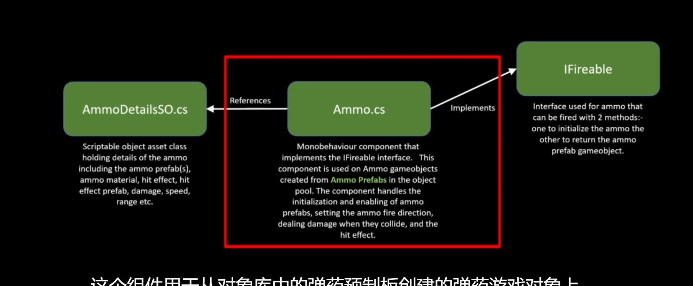

# Dungeon Gunner

为什么要用

怎么用的

效果如何


## 基于EditorWindow的可视化地牢模板编辑搭建系统


## 基于Tilemap的地图搭建以及小地图

## 粒子系统实现的武器烟雾，击中特效等


## 基于上述方法搭建模板后，随机地牢地图生成

基于状态机实现的敌人AI

分为三个类：Trigger\<T>，用于配置转换条件

State\<T>，状态的基类，继承这个基类的要实现具体的转换逻辑

StateMachine\<T>，Update里检测Trigger和State（通过特定的命名规则和配置文件，通过反射构建状态机）


有一个范围内的巡逻，一定范围内检测到才开始寻路，超出范围丢失继续巡逻。

## ScriptableObject进行武器，音效，子弹效果配置以及玩家配置、地牢房间配置。

通过暴露一定参数的方式，通过配置文件以及代码控制音效、武器特效等。

配合Pool Manager：

以音效系统为例子，因为是2D游戏，所以是2D音效，不涉及空间的3D音效。因此采用的方式是，制作一个挂载有AudioResouce的Prefab，做好通用设置。放入对象池。对于不同的音效clip，通过ScriptableObject配置。然后用一个SoundEffectManager统一管理。播放的时候就从对象池里拿出来一个对象然后初始化然后播放。播放完再回收

子弹特效这里分成三部分：

1. 发射枪口特效
2. 子弹轨迹
3. 击中特效

## 单例基类

```c#
public abstract class SingletonMonbehaviour<T> : MonoBehaviour where T : MonoBehaviour
{
    private static T _instance;
    public static T Instance
    {
        get
        {
            return _instance;
        }
    }
    protected virtual void Awake()
    {
        if (_instance == null)
        {
            _instance = this as T;
        }
        else
        {
            Destroy(gameObject);
        }
    }
}
```


## 事件系统

> 事件系统驱动的
>
> 武器系统，UI系统以及动作+Animation
>
> 1. 我们想要抽象出一个通用的系统，让他对于player和enemy都适用
> 2. 解耦，比如动作这里，对于不同类型的Player，或者Enemy，我们都有不同的移动方式，比如有的是瞬移，有的是正常移动，这时候有不同的动画效果还有不同的移动方式，用事件驱动就可以各自自己处理而不用写在一起。
> 3. 

武器系统




# 优化：

## Object Pooling优化

通用对象池，管理子弹，音效，特效

> 为什么适用：
>
> 1. 确实有大量的比如子弹，图形效果音效等需要被频繁创建和销毁
> 2. 垃圾回收确实会影响到具体的性能（加一个通过Profiler调试），存在CPU峰值
> 3. 上述的比如子弹等对象是相对比较小比较简单的类，因此做一个对象池不会有很大的内存“footprint”，不会造成太多的内存占用
> 4. 做一个通用的Component对象池


PoolManager里维护一个Dic，Key是Prefab的InstanceID，value是一个Queue<Compoent>。里面存储的具体类型是通过string来从Type.GetType的反射拿到的


这里的回收用的是设置为Disable，然后如果要重新取用的话就直接从Pool里面拿。而不是主动的放回Pool。这是为了更多的适应更多的系统。比如对于粒子系统，通过直接配置就可以触发Disable

## 使用AStar进行寻路并通过 Profile进行优化


通过Profile，查看CPU占用，发现卡顿的原因是因为，

最开始：寻路太频繁，每帧都在寻路（因为玩家一直在动）-> 设置寻路的冷却时间以及Player要动起来一定距离再更新寻路（在原地就按照原来的寻路）

然后：

1. 一个房间里的Enemy寻路，都会在同一帧进行寻路路径的构建->给每一个Enemy设置一个寻路的帧，不到这个帧的时候就不寻路，到了之后再寻路。相当于把每个Enemy每帧的寻路都分散在不同的帧（最开始大概10个敌人寻路要1000ms，优化后，寻路的峰值被分散在十帧上，每帧80ms）
2. 排序占用很多=>自己写了一个优先队列


优先路径：

通过对不同Tile类型给与不同的惩罚，让AI优先选择一定的路径

## 仅激活摄像机可视范围内的房间，对于之外的房间则取消激活，降低运算压力。

相机视口和房间包围体求交集

## PolygonCollider2D

通过Sprite的形状，自动生成物理性状，然后通过物理形状节点设置PolygonCollider2D

```c#
private void SetWeapon(Weapon weapon){
        currentWeapon = weapon;
        weaponSpriteRenderer.sprite = weapon.weaponDetails.weaponSprite;
        if (weaponPolygonCollider2D != null && weaponSpriteRenderer.sprite != null)
        {
            List<Vector2> spritePhysicsShapePointsList = new List<Vector2>();
            weaponSpriteRenderer.sprite.GetPhysicsShape(0, spritePhysicsShapePointsList);
            weaponPolygonCollider2D.points = spritePhysicsShapePointsList.ToArray();

        }
    }
```

## UV

UV存储的是模型顶点到贴图的映射关系，而不是贴图到顶点的关系


## 协程的作用：

1. 分布任务：

比如去做一个进度条，每一帧往前一点点

2. 定时任务

比如确定一个时间，5s后终止某个东西，那么就可以用协程yield return new WaitForSecond(t)


## 运动拆解

敌人AI拆解：

- 移动
- 射击
- 瞄准
- 开火

分别对应一个事件，由一个EnemyAIController发布并且看准时机调用


## 武器发射配置：

首先是有一个配置文件，里面会存储对应的Prefab。

再Object Pool里面提前配置好对应Prefab的对象，然后发射的时候，每次生成子弹都从对象池里根据配置文件的Prefab查找


## 多次Collision检测

在连续监测里面，一帧可能会多次调用OnTrigger/OnCollision方法进行碰撞检测。因此可能会出现异常的多次碰撞，因此可以用一个bool变量，标记是否已经检测过了，如果是那就retur


## LayerMask

通过二进制运算，来比较LayerMask。

为什么不直接看是否相等呢？

LayerMask可能设置了好几层，但是进来的collision就只能在一层上。同过位运算可以发现是不是在LayerMask期望的层而不用完全相等

        int collisionObjectLayerMask = (1 << collision.gameObject.layer);
        if ((layerMask.value & collisionObjectLayerMask) == 0)
        {
            return;
        }

## Invoke延迟调用

`Invoke` 是 Unity 提供的方法，用于 **在一定时间后调用指定的方法**。


```c#
Invoke(string methodName, float time);
```

- **`methodName`**（`string`）：要调用的方法名称（必须是当前类中的 `public` 或 `private` 方法）。
- **`time`**（`float`）：调用该方法的延迟时间（秒）。
