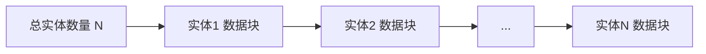
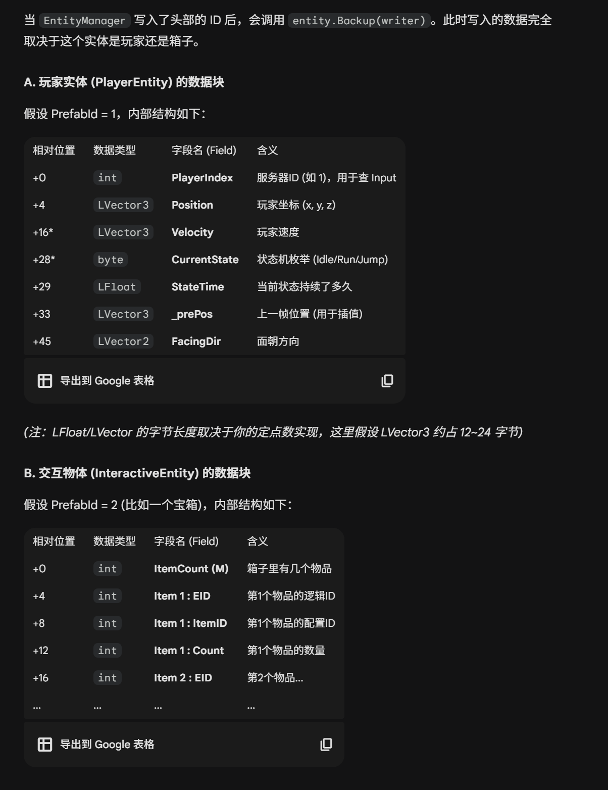
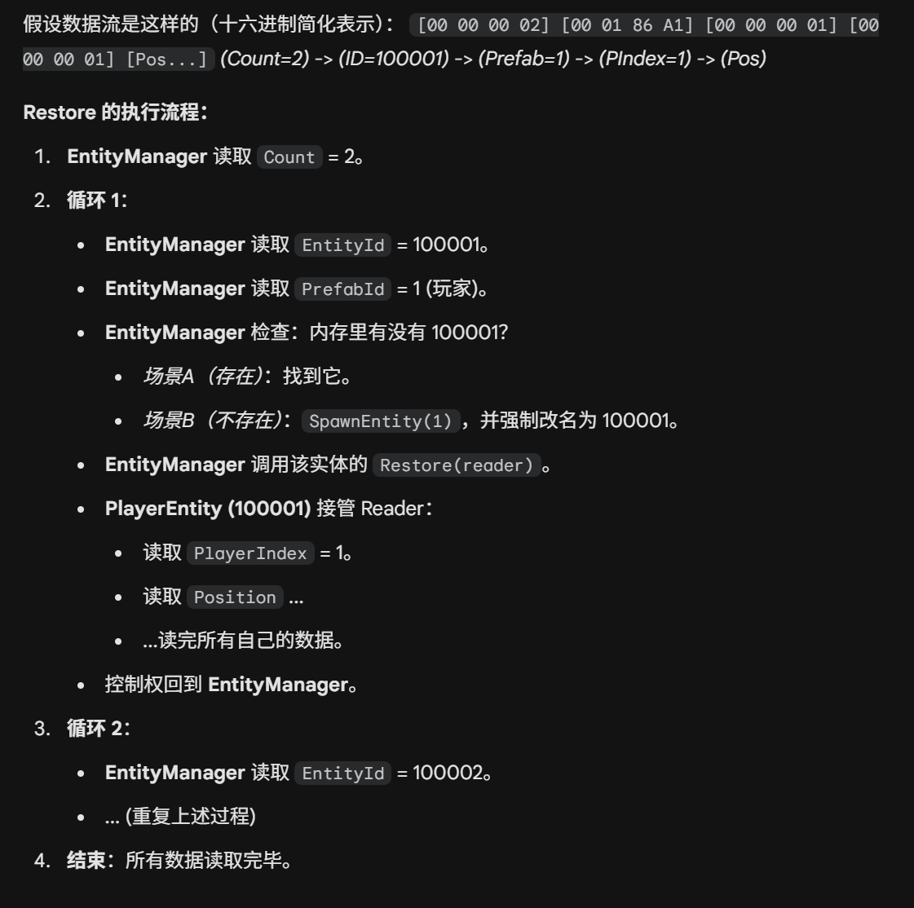

# EntityManager

EntityManager的设计我主要是为了统一一个实体的回滚入口，并且当实体存在本身需要回滚的时候有一个处理的地方


## 回滚





```cpp
[ 整个世界的二进制快照 ]

+-------------------------------------------------------+
| 实体总数 (int) : 2                                     |
+-------------------------------------------------------+
| [实体1 头信息]                                         |
|   - EntityId (int) : 100001                           |
|   - PrefabId (int) : 1 (Player)                       |
|-------------------------------------------------------|
| [实体1 身体数据 (由 PlayerEntity 解析)]                 |
|   - PlayerIndex (int)    : 1                          |
|   - Position (Vector3)   : (100, 0, 50)               |
|   - Velocity (Vector3)   : (0, 0, 0)                  |
|   - State (byte)         : 1 (Move)                   |
|   - StateTime (LFloat)   : 0.5                        |
|   - ...                                               |
+-------------------------------------------------------+
| [实体2 头信息]                                         |
|   - EntityId (int) : 100002                           |
|   - PrefabId (int) : 2 (Chest)                        |
|-------------------------------------------------------|
| [实体2 身体数据 (由 InteractiveEntity 解析)]            |
|   - ItemCount (int)      : 1                          |
|   - [物品1]                                            |
|       - ItemEID (int)    : 100003                     |
|       - ItemID (int)     : 501 (Apple)                |
|       - Count (int)      : 10                         |
+-------------------------------------------------------+
```



