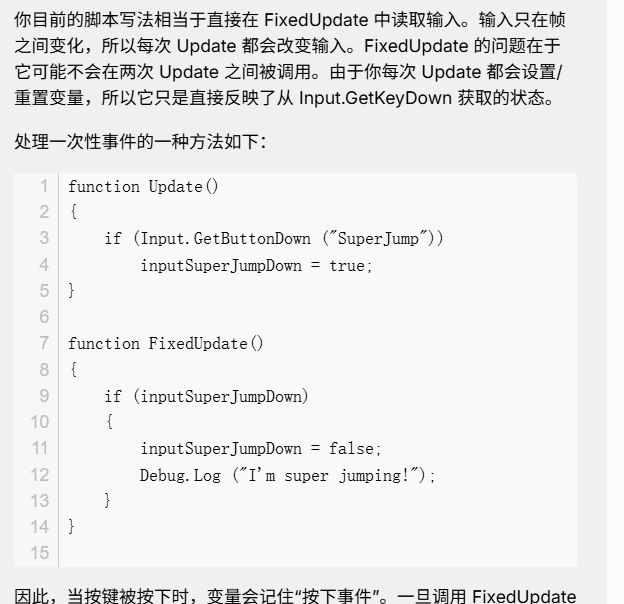
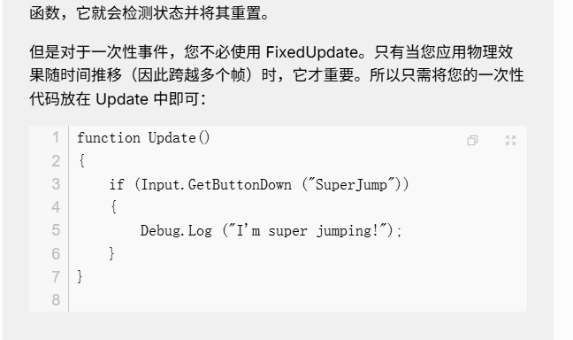

# InputManager

## 为什么需要一个InputManager

因为Unity的Input是跟着Unity的渲染帧走的，而我们的帧同步的逻辑是跟随固定的时间步长走的，所以可能会出现一个问题就是，按下按钮用Input.GetbuttonDown的时候，我们的DoLogicStep还没走到，里面的检测可能就检测不到

类似的问题在FixUpdate也有：https://discussions.unity.com/t/eliminating-input-loss/64711/2

一个场景：

> 比如现在我的Collision当中有OnLSCollsionStay的回调函数，我想在这个函数里检测E按是否按下，我确实这样做了，但是结果就是按下的回调是没法一定触发的。这就是因为Input是跟着Update走的，而我的OnLSCollsionStay的检测是跟着LFloat的dt走的，这一个定长，而渲染帧和这个可能不同步
>
> 类似这个问题：
>
> 

## 解决方法

其实就是在Update当中缓存下来按键是否按下，如果按下就标记，并且在DoLogicStep的末尾清空

## 操作分类

其实操作分两类，

一类是需要同步的，比如玩家的移动，攻击

一类是不需要同步的，比如单纯的打开箱子，看告示牌这种