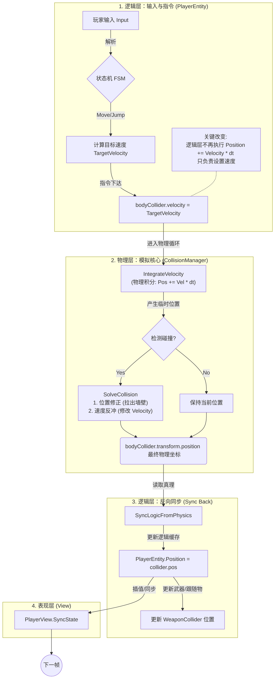
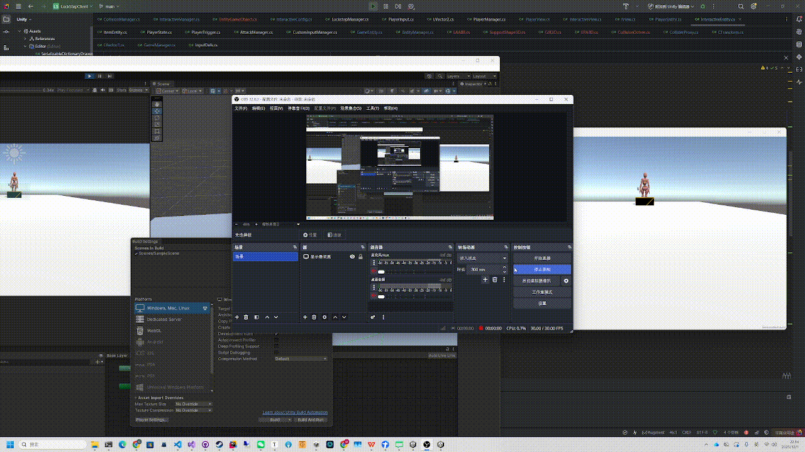
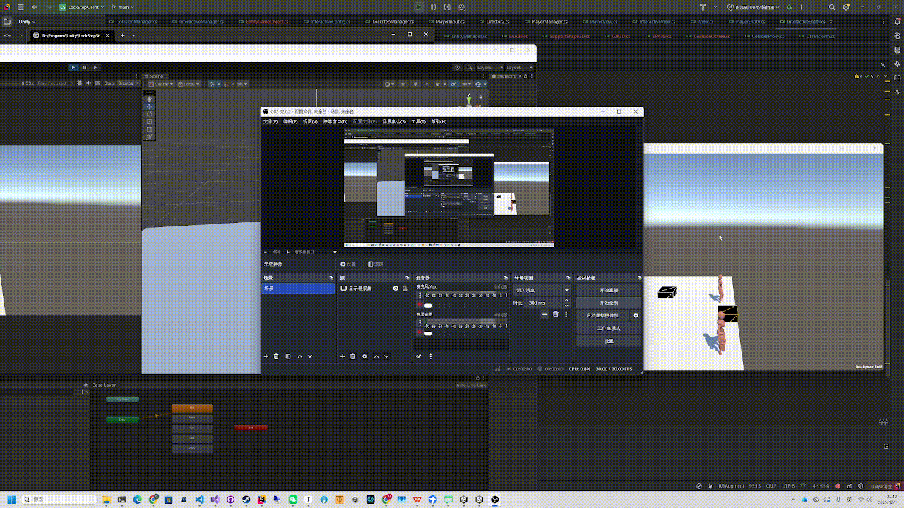
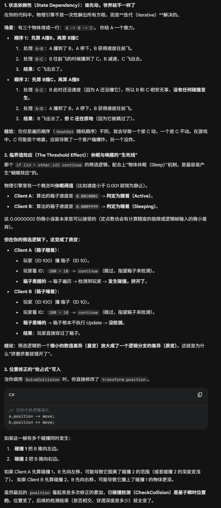
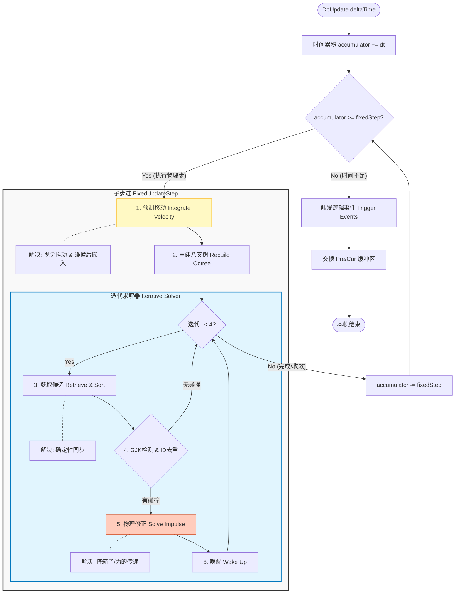
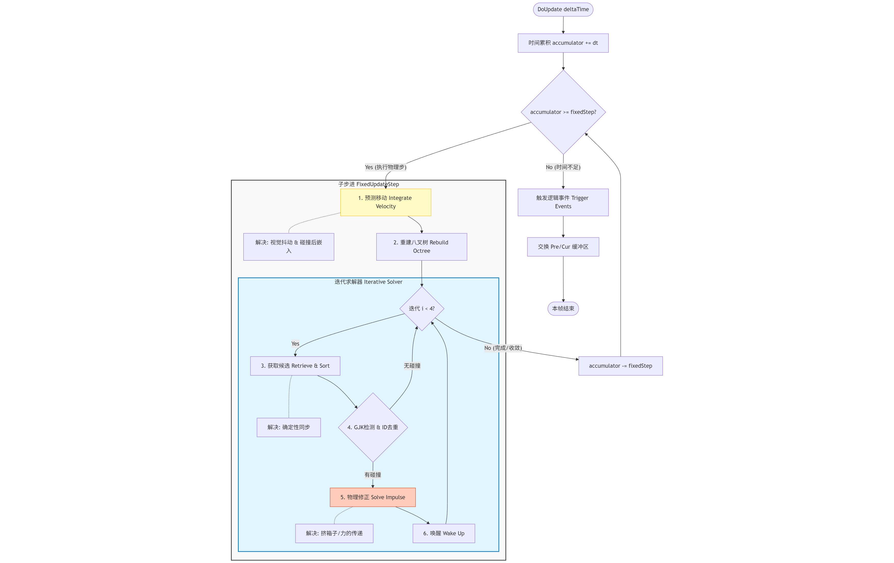
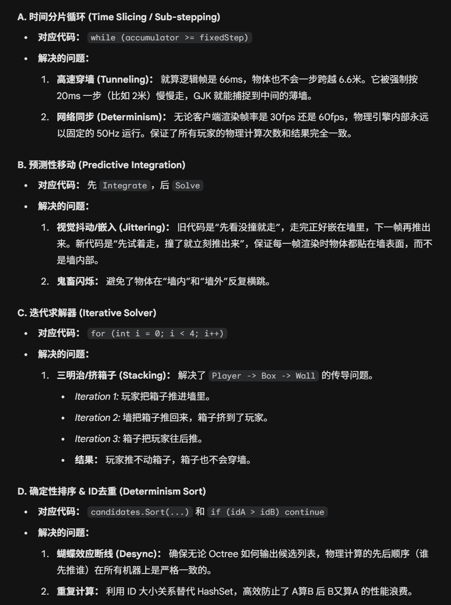

# 物理碰撞

## 流程梳理：

每一个逻辑帧包括多个物理帧（DCD）

每个物理帧的计算都是先根据速度积分位移，然后检测是否碰撞，如果碰撞，根据EPA的结果修正位移同时影响反冲速度。在下一轮物理帧迭代的时候影响积分


## 输入和移动的关系

输入（Input）决定速度（Velocity），物理系统通过积分（Integration）将速度转化为位移（Position）





## 确定性保证：

先看俩，一个是确定的碰撞一个是碰撞结果不确定





为啥会这样的，下面几条总结

### 排序造成的问题

需要一个确定性排序

八叉树，EPA，包括最后的冲量积分都会受到访问检测顺序的影响

为了保证这种确定性，必须要备份可物理交互物体的物理信息（看Interactive）

物理模拟是一个严重依赖“当前状态”的连续过程，而不是简单的数学求和。

比如在两个客户端上，对于PlayerA，BoxA和PlayerB的处理顺序不同，就会导致积分的结果不同，一定要时刻保证任何情况下，不同客户端处理顺序是完全一致的




### 回滚备份


## 八叉树

### 父节点滞留的八叉树

如果一个节点骑在边界上，那么它就会停留在父节点

插入Octree的节点会留在尽可能深的能完整容纳它的一层（不一定是叶子节点）

### 优化：非完全重建

八叉树在插入的时候，会进行空间划分，每一帧都清空八叉树，重建新的八叉树

```c#
public void Clear() {
        _objects.Clear();
        // 不要把 _nodes[i] 设为 null！
        if (_nodes[0] != null) {
            for (int i = 0; i < _nodes.Length; i++) {
                if (_nodes[i] != null) {
                    _nodes[i].Clear();
                }
            }
        }
    }
private void Split() {
        // ... 计算 center, subSize ...
        
        for (int i = 0; i < 8; i++) {
            // ... 计算 subCenter ...
            
            if (_nodes[i] == null) {
                // 只有第一次才 new，以后都复用
                _nodes[i] = new CollisionOctree(_level + 1, new LAABB(subCenter, subSize));
            }
            // 可以在这里重置子节点的 bounds (如果你的世界边界会动态变的话，通常不需要)
        }
    }
```

为了减少GC，才用非破坏性的重建，意思是，在清空八叉树的时候，不把node也清空，只是把node中存储的碰撞体信息清空，下次重建的时候就不用重新申请节点了

> Q1: 如果复用了节点，会不会因为上一次分得很细，导致这一次物体被强行塞到很深的地方？
>
> 不会，实际上，由于父节点滞留的八叉树，这个前提，这就保证了，如果插入的节点到了一个跨界的位置就会滞留下来，不会无限的插入下去


### 优化：静态与动态分离

用两棵树，分别存储动态和静态的八叉树，静态八叉树就是那些设置为IsStaic的，永远不移动，也不重建八叉树


## EPA + 基于冲量的解算器

### EPA的意义

EPA的输入是GJK的输出的单纯形，对于两个碰撞的物体，让他俩分开，其实就等价于，把闵可夫斯基差构造的凸体的原点，移动到边界上，我们当然是要找到一个最近的边界，因此EPA就是，找到这样一个边界，距离原点最近，然后返回值就是一个向量，这个向量的方向就是两个物体移动的方向（和反方向），向量的长度就是具体推动多少距离


### EPA退出时机

```c#
// 检查是否收敛 (新点距离面的距离非常小)
            LFloat supportDist = LVector3.Dot(searchDir, support);
            if (supportDist - closestFace.dist < LFloat.EPSILON) {
                // 收敛：穿透向量就是 dist * normal
                return closestFace.normal * supportDist;
            }
```

代码里我是这样写的，我们知道EPA是尝试去扩张一个多面体，让这个多面体尽可能的逼近闵可夫斯基差的多面体，在这个过程中找到距离原点最近的边界。

如果针对定点数棱角分明的两个碰撞体，这里的 <LFloat.EPSILON 的情况指的其实就是，**当我们发现，之前加入的**当前多面体的顶点，又被加入了，那说明真的已经找到最近的边界了

如果针对的是球，胶囊这种碰撞体，那这里的 <LFloat.EPSILON指的其实就是一种逼近，因为棱角分明的物体的顶点是有一个具体数的，但是球体这种，边界有无数个点，因此这里指的就是，我们每次查找的时候都找一个新的点加入，一直到加入新的点对于进一步逼近边界的作用不大，这时候就退出了。

## 基于冲量的解算器

> 你的疑惑很正常：教科书上的 **动量守恒公式** 是描述“结果”的（碰撞前=碰撞后），而代码里算的是一个叫 `j` (冲量) 的东西，看起来完全不一样。
>
> 但其实，**代码里的公式（冲量公式）正是由【动量守恒公式】+【能量恢复系数公式】联立推导出来的解。**
>
> 让我为你揭开这个推导过程，你会发现代码里的每一行都能和物理公式对应上。
>
> ------
>
> ### 1. 我们有两个物理定律
>
> 想要算出碰撞后的速度 $v_1'$ 和 $v_2'$，仅靠动量守恒是不够的（方程组解不出来），我们需要两个方程联立：
>
> #### 方程 A：动量守恒定律 
>
> $$m_1 v_1 + m_2 v_2 = m_1 v_1' + m_2 v_2'$$
>
> (这意味着：两人交换的动量必须相等，我给你多少，你就收多少，总量不变)
>
> #### 方程 B：牛顿恢复定律 (决定了弹不弹)
>
> $$(v_2' - v_1') \cdot n = -e \cdot ((v_2 - v_1) \cdot n)$$
>
> (这意味着：碰撞后的相对速度 = -e $\times$ 碰撞前的相对速度)
>
> - $n$ 是法线 = >EPA 算出的穿透向量归一化后就是法线
> - $e$ 是弹性系数 (`bounciness`)。
>
> ------
>
> ### 2. 把方程换个写法 (引入冲量 J)
>
> 直接解上面的方程组求 $v'$ 在代码里很麻烦。物理引擎通常使用 **冲量 (Impulse, $J$)** 来简化计算。
>
> 根据动量定理，速度的变化量等于冲量除以质量：
>
> - **物体 1 的新速度：** $v_1' = v_1 - \frac{J}{m_1} n$  (因为受到反作用力，方向为负)
> - **物体 2 的新速度：** $v_2' = v_2 + \frac{J}{m_2} n$  (方向为正)
>
> **注意：** 只要我们是用同一个 $J$ 给两个物体加减速度，**方程 A (动量守恒) 就已经自动满足了！** (因为加减抵消了)。
>
> 所以，我们现在的任务变成了：**求出这个 $J$ 到底是多少，才能满足方程 B (弹性)？**
>
> ------
>
> ### 3. 推导代码里的公式 (见证奇迹的时刻)
>
> 我们将上面 $v_1'$ 和 $v_2'$ 的表达式，代入到 **方程 B** 中：
>
> $$\left( (v_2 + \frac{J}{m_2}n) - (v_1 - \frac{J}{m_1}n) \right) \cdot n = -e (v_{rel})$$
>
> 这里 $v_{rel} = (v_2 - v_1) \cdot n$ (即代码里的 `velAlongNormal`)。
>
> 展开左边：
>
> $$(v_2 - v_1)\cdot n + J(\frac{1}{m_2} + \frac{1}{m_1}) = -e \cdot v_{rel}$$
>
> 把 $(v_2 - v_1)\cdot n$ 替换为 $v_{rel}$：
>
> 
>
> $$v_{rel} + J(\frac{1}{m_1} + \frac{1}{m_2}) = -e \cdot v_{rel}$$
>
> 移项，把 $J$ 留在左边：
>
> 
>
> $$J(\frac{1}{m_1} + \frac{1}{m_2}) = -e \cdot v_{rel} - v_{rel}$$
>
> $$J(\frac{1}{m_1} + \frac{1}{m_2}) = -(1 + e) \cdot v_{rel}$$
>
> 最终解出 J：
>
> 
>
> $$J = \frac{-(1 + e) \cdot v_{rel}}{ \frac{1}{m_1} + \frac{1}{m_2} }$$
>
> ------
>
> ### 4. 回看你的代码
>
> 现在，把最后推导出来的公式和你的代码对比一下：
>
> - **分子：** `-(1 + e) * velAlongNormal`
>   - 对应公式：$ -(1 + e) \cdot v_{rel} $
> - **分母：** `totalInvMass` (即 `a.InvMass + b.InvMass`)
>   - 对应公式：$ \frac{1}{m_1} + \frac{1}{m_2} $
> - **结果：** `LFloat j`
>   - 对应公式：$J$
>
> ```C#
> LFloat j = -(LFloat.one + e) * velAlongNormal / totalInvMass;
> ```
>
> ### 结论
>
> 你原本知道的公式 $m_{1}v_{1}+m_{2}v_{2}=m_{1}v_{1}^{\prime }+m_{2}v_{2}^{\prime }$ 是**宏观的守恒结果**。
>
> 而代码里的公式，是为了**构造**出这个结果，反向推导出的**微观操作步骤**（即：我到底要推多大力 $J$，才能既守恒，又符合弹性系数 $e$）。
>
> 所以，这段代码本质上就是**动量守恒定律的工程实现版**。

## **离散碰撞检测 (Discrete Collision Detection)”** 与**“序列脉冲 (Sequential Impulse)”** 的问题以及改进

### 问题梳理

#### 约束传递 =>穿模(三明治挤箱子)

原本的实现存在一个问题：

更新只更新一次；比如考虑一个场景，PlayerA和PlayerB一起去BoxA

按照原来的实现方式的更新逻辑是：检测PlayerA和BoxA，发生碰撞了，把BoxA推向对面，检测BoxA和PlayerB，把BoxA又推向了反方向，这时候就穿模了（无论顺序怎么变，总有一边是穿模的）

本质问题是因为，一个物理帧的模拟当中，是离散的碰撞检测，只做一次遍历一次迭代

这样导致的结果是：**约束无法传递（三明治问题）**

#### 更新顺序=> 穿模

这里的更新顺序指的是： **检测 (Check)**、**修正 (Solve)**和**移动 (Move)**

原本我的顺序是：先检测是否发生碰撞，如果没有就允许移动，如果速度过快，就会导致穿模

```c#
public override void DoUpdate(LFloat deltaTime) {
    // ... 准备数据 ...

    // 【步骤 1】检测当前位置的碰撞
    // 此时物体还在上一帧结束的位置 (假设 Pos = 0, 墙在 10)
    CheckListCollision(curMoveColliderObject); 
    // 结果：没撞上 (0 < 10)，不修正。

    // 【步骤 2】积分移动 (让速度生效)
    // 假设速度极快 Vel = 20, dt = 1
    // Pos += 20 * 1 = 20
    IntegrateVelocity(curMoveColliderObject, deltaTime);
    // 结果：物体现在的 Pos = 20。已经深深地插到了墙(10)的后面。

    // 【步骤 3】本帧结束，提交给 Unity 渲染
    // 画面上：玩家看到物体出现在坐标 20 的位置（墙后）。
    // 玩家大喊：“穿模了！”
}
```

新的方式是，先假设移动，如果撞了就推回去，然后再驱动渲染：

```c#
private void FixedUpdateStep(LFloat dt) {
    
    // 【步骤 1】先移动 (预测)
    //这里的预测和帧同步的预测是不一样的，这里的预测指的是，我们假设他们没有发生碰撞可以移动到哪里去（并且是固定一个小步长）
    // 假设 Pos = 0, Vel = 20.
    // 物体尝试移动到 Pos = 20。
    IntegrateVelocity(allActive, dt); 

    // 【步骤 2】重建八叉树
    // 因为位置变了(0 -> 20)，必须更新空间索引，否则检测不到墙。
    RebuildDynamicOctree();

    // 【步骤 3】检测 & 修正
    // 发现 Pos(20) 和 墙(10) 重叠了！
    // SolveCollision 计算出 penetration = -10。
    // 修正：Pos -= 10。
    // 结果：物体现在的 Pos = 10 (紧贴墙面)。
    SolveCollisionsIteratively(allActive);

    // 【步骤 4】本帧结束，提交给 Unity 渲染
    // 画面上：玩家看到物体停在坐标 10。
    // 玩家：“丝般顺滑，完全没穿模。”
}
```

### 时间步进策略

意思其实就是时间戳太长了，对于逻辑帧来说，可以保持比如0.02ms一帧，但是对于物理帧来说，就要再对这个帧率再细分了，否则算出来的移动步长就太长了，就容易穿模

将 **“逻辑帧（Logic Frame）”** 和 **“物理步（Physics Step）”** 解耦

## 改进：**离散检测的子步进 (Discrete Sub-stepping)** / **求解器迭代 (Solver Iterations)** 

这里是离散碰撞检测（Discrete Collision Detection, DCD）

先移动后检测 + 子步进 + 多次迭代

在**这一帧（微观时间）**内，我假设物体不受阻挡，先让它根据速度走一步

子步进指的是，在DoUpdate之外，每次逻辑帧驱动碰撞系统的时候，都把他分为更细分的子迭代，这是为了解决穿模问题

求解器迭代是为了解决三明治问题







## 优化： 剪枝查询对象

每一帧并不是对所有的碰撞体都去检查是否和其他碰撞体碰撞的，而是分了两个集合：

```c#
    public HashSet<ColliderProxy> preMoveColliderObject = new HashSet<ColliderProxy>();
    public HashSet<ColliderProxy> curMoveColliderObject = new HashSet<ColliderProxy>();
```

1. 检查这一帧主动运动的物体（也就是Dirty的碰撞体
2. 检查上一帧存在碰撞过的物体

主动运动的物体会在物理计算中被添加，因为在解算器计算移动的时候，可能会出现一个物体被挤着走的情况，这时候这些物体也要被在帧内添加进运动的物体加入下一轮的计算

```c#
        //其实就是计算动量守恒 + 牛顿恢复定律   
        //冲量其实就是和重量相关的瞬间动量变化，最后影响速度
        // 如果物体被力推动了，必须强制加入 curMoveColliderObject
        // 这样它才能在下一个子步进或下一帧被 IntegrateVelocity 积分移动
        // 否则它就是个有了速度但不移动的幽灵
        if (!a.isStatic) {
            a.velocity -= impulse * a.InvMass;
            curMoveColliderObject.Add(a); // 唤醒 A
        }
        if (!b.isStatic) {
            b.velocity += impulse * b.InvMass;
            curMoveColliderObject.Add(b); // 唤醒 B (例如踢飞箱子)
        }
```

