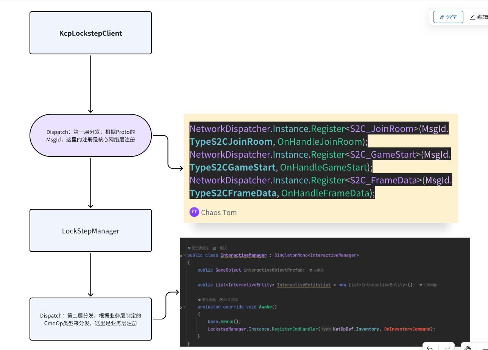

# 网络层

## 网络层设计

网络层是两层分层



这样可以很好的解耦系统状态（第一层）和业务状态（第二层的复杂操作）

同时，第二层的设置很重要的一点是可以不需要修改ProtoBuff就支持更复杂的复杂操作，只要约定好NetOpDef和序列化反序列化就可以了

## 帧同步更新

主要说一下帧同步的更新

帧同步这部分的核心在于在什么时机执行：预测，追帧，回滚和发送

还是要依靠Unity的主循环Update，但是在主循环里要实现固定步长的更新


## 追帧，回滚

我们有一个queue用来充当FrameBuffer。这里合并了几个帧，正常来说，我们需要有：当前收到的最新的权威帧的帧号，当前已经处理过的权威帧的帧号，客户端的当前帧的帧号，这三个帧号来比对。但是通过这样一个queue，我们规定，frameBuffer的开头就是当前马上要处理的权威帧，frameBuffer的Count就是我们还没处理过的权威帧的数量，同时再维护一个客户端当前帧就可以了

```c#
	void Update(){
		int processedCount = 0;
        int targetPredictionTick = ClientTick;
        //_frameBuffer里存储的，永远是需要但还没处理的，权威帧
        while (_frameBuffer.Count > 0 && processedCount < _limitFrameCount)
        {
            FrameMessage serverFrame = _frameBuffer.Peek();
            _lastServerTick = serverFrame.Tick;
            processedCount++;
            //即将处理的服务器帧 = 本地帧。其实说明可能落后
            if (serverFrame.Tick == ClientTick)
            {
                Dictionary<int, PlayerInput> authoritativeInputs = ConvertProtoInputs2PlayerInputs(serverFrame.Inputs);
                SaveInputToHistory(ClientTick, authoritativeInputs);
                SimulateFrame(ClientTick, authoritativeInputs);
                ClientTick++;
                _frameBuffer.Dequeue();
            }
            //服务器帧比本地快 追帧
            else if (serverFrame.Tick > ClientTick)
            {
                // 直接使用权威输入执行，不预测
                Dictionary<int, PlayerInput> authoritativeInputs = ConvertProtoInputs2PlayerInputs(serverFrame.Inputs);
                SaveInputToHistory(serverFrame.Tick, authoritativeInputs);
                // 执行
                SimulateFrame(serverFrame.Tick, authoritativeInputs);
                ClientTick = serverFrame.Tick + 1; // 修正 ClientTick
                _frameBuffer.Dequeue();
            }
            //服务器帧 < 本地帧（回滚检测）
            else 
            {
                _frameBuffer.Dequeue();
                // 检查本地历史记录是否和服务器权威输入一致
                bool needRollback = CheckNeedRollback(serverFrame); 
                if (needRollback)
                {
                    Debug.LogWarning($"[Rollback] Diff at {serverFrame.Tick}. LocalTick: {ClientTick}");
                    // 回滚到错误帧的前一帧状态
                    int resetTick = serverFrame.Tick - 1;
                    if (RollbackManager.Instance.RollbackTo(resetTick))
                    {
                        // 修正当前Tick的历史输入为权威输入
                        var authoritativeInputs = ConvertProtoInputs2PlayerInputs(serverFrame.Inputs);
                        SaveInputToHistory(serverFrame.Tick, authoritativeInputs);
                        // 重新执行当前帧（权威）
                        SimulateFrame(serverFrame.Tick, authoritativeInputs);
                        ClientTick = serverFrame.Tick + 1;
                        // 追帧在下一次循环中完成
                        //延迟重演
                    }
                }
                else
                {
                        // 预测正确，也用权威输入覆盖历史，消除浮点误差
                    SaveInputToHistory(serverFrame.Tick, ConvertProtoInputs2PlayerInputs(serverFrame.Inputs));
                }
            }
        }
    }
```

上述代码由外层的一个while为核心：当Buffer中还存在没有处理的权威帧，并且当前帧没有处理太多（防止阻塞）
```c#
while (_frameBuffer.Count > 0 && processedCount < _limitFrameCount){
     //...
}
```

通过比较马上需要被处理的权威帧的帧号，和本地的帧号，有几种结果：

1. serverFrame.Tick == ClientTick 说明可以直接应用权威帧的输入作为模拟，两者匹配上了。同时，如果frameBuffer里还存在后续的frame，那就说明本地帧其实已经落后了，而while循环就会追帧。
2. serverFrame.Tick < ClientTick 说明本地快，这说明本地发生了预测，同时因为现在frameBuffer中存在需要被处理的权威帧，因此这时候要校验权威帧和预测帧之间是否匹配，如果不匹配就要回滚到当前这个serverFrame.Tick - 1的状态
3. serverFrame.Tick > ClientTick 说明缺帧了，因为正常模拟是不会出现这种情况的。

## 重演 Re-Play / Re-Simulat

在完成上面的回滚和追帧之后，现在剩下的，就应该是最新的（如果网络情况正常，没有剩下太多帧的积压）的权威状态了，这时候如果发生过回滚，ClientTick 会被重置到过去，为了防止突然闪现，就要补齐预测帧到targetPredictionTick，targetPredictionTick指的是，发生回滚前的ClientTick

**这里严格来说并不是预测，而是补齐，或者重演**，这里会优先使用回滚之前的历史输入来重新演算，方式丢操作

```c#
        // 补齐预测帧
        // 如果发生过回滚，ClientTick 会被重置到过去。
        // 此时 Buffer 已经空了，我们需要利用本地历史输入把状态从 ClientTick 追回 targetPredictionTick。
        // 否则玩家会看到画面瞬间回退到过去。
        if (ClientTick < targetPredictionTick)
        {
            // 重新模拟这中间的每一帧
            for (int t = ClientTick; t < targetPredictionTick; t++)
            {
                Dictionary<int, PlayerInput> inputs;

                // 优先尝试从 _inputHistory 获取已经存在的输入
                // 这样能保留玩家在回滚前那一瞬间按下的“跳跃”或“技能”指令
                if (_inputHistory.TryGetValue(t, out var historyInputs))
                {
                    inputs = historyInputs;
                }
                else
                {
                    // 只有万一没有历史记录时，才进行预测
                    inputs = PredictInputs(t);
                    SaveInputToHistory(t, inputs);
                }

                // 重用这个输入去跑逻辑
                // 因为状态（位置、血量等）已经被回滚修正了，所以即使输入一样，跑出来的结果也会是修正后的正确结果
                SimulateFrame(t, inputs);
            }
            // 补齐完毕，恢复到原来的预测进度
            ClientTick = targetPredictionTick;
        }
```

## 预测和发送

这其实用到了FixedUpdate相同的原理：双循环。双循环实际上做的是这样一件事情：其实无论是物理模拟，还是帧同步，他们都没法保证在相同的时间点发生绝对相同的一帧。

什么意思呢，主循环Update是一定会收到上一帧的渲染时间等因素的影响的，所以两帧之间的间隔不同，但是通过内层的计数器+循环，可以保证，当某一帧过长阻塞了一段时间后，下一帧可以补上去。这就是所谓的内层循环起到的作用

```c#
while(true){
     _accumulation += new LFloat(true,(int)(Time.deltaTime * LFloat.Precision));
      while (_accumulation >= LayerFrameRate)
      {
          //...
      }
}
```

我们的框架的发送就是基于这样一个双循环，他保证，固定的帧发送固定的东西，如果上一帧时间过长，那么在下一帧他会用一个while循环追帧间隔帧。

同时预测体现在：对于帧同步来说，即使是本地的操作也应该等待服务器的数据驱动，但是当frameBuffer空了之后，如果新的数据还没来，就会发生等待，因此可以先执行本地的输入，以及其他Client对象上一帧的预测延续来暂时驱动，等到服务器消息下来了再校验和回滚

```c#
// -正常时间步进
        // 只有当 Buffer 处理完，且状态也补齐后，才根据时间流逝尝试预测
        if (_frameBuffer.Count == 0)
        {
            _accumulation += new LFloat(true,(int)(Time.deltaTime * LFloat.Precision));

            while (_accumulation >= LayerFrameRate)
            {
                _accumulation -= LayerFrameRate;

                // 限制最大预测步数
                if (ClientTick - _lastServerTick < MaxPredictionFrames)
                {
                    var predictedInputs = PredictInputs(ClientTick);
                    
                    if (GameManager.Instance.playerGuid != 0) // 确保有合法的本地玩家ID
                    {
                        // 从预测输入表中取出本地玩家的输入
                        if(predictedInputs.TryGetValue(GameManager.Instance.playerGuid, out var myInput))
                        {
                            KcpLockstepClient.Instance.SendInput(myInput);
                        }
                    }
                    
                    SaveInputToHistory(ClientTick, predictedInputs);
                    SimulateFrame(ClientTick, predictedInputs);
                    ClientTick++;
                    // 顺便更新一下目标tick，防止逻辑跳变
                    targetPredictionTick = ClientTick; 
                }
            }
        }


// 如果是追最新帧 -> 用 Unity Input
    // 如果是回滚重演 -> 沿用历史记录中的上一帧（因为那是修正后的权威数据）
    private Dictionary<int, PlayerInput> PredictInputs(int currentTick)
    {
        var inputs = new Dictionary<int, PlayerInput>();
        
        // 获取上一帧的输入作为基准
        int prevTick = currentTick - 1;
        Dictionary<int, PlayerInput> prevInputs = null;
        _inputHistory.TryGetValue(prevTick, out prevInputs);

        // 遍历所有玩家
        if (GameManager.Instance.playerManager != null && GameManager.Instance.playerManager.PlayerId2EntitiesDic != null)
        {
            foreach(var id in GameManager.Instance.playerManager.PlayerId2EntitiesDic.Keys)
            {
                PlayerInput pInput = new PlayerInput { id = id, inputUV = LVector2.zero };

                // 只有在预测未来的新帧，且是本地玩家时，才使用 Input.GetAxis
                if (id == GameManager.Instance.playerGuid && currentTick == ClientTick && GameManager.Instance.curPlayerInput != null)
                {
                    pInput = GameManager.Instance.PlayerInputMono.CollectPlayerInput(id);
                }
                else
                {
                    // 其他情况（非本地玩家，或正在回滚重演过去帧），沿用上一帧
                    // 这里的 prevInputs 已经是被修正过的（如果是回滚后）
                    if (prevInputs != null && prevInputs.ContainsKey(id))
                    {
                        pInput = ClonePlayerInput(prevInputs[id]);
                    }
                }
                inputs[id] = pInput;
            }
        }
        return inputs;
    }
```