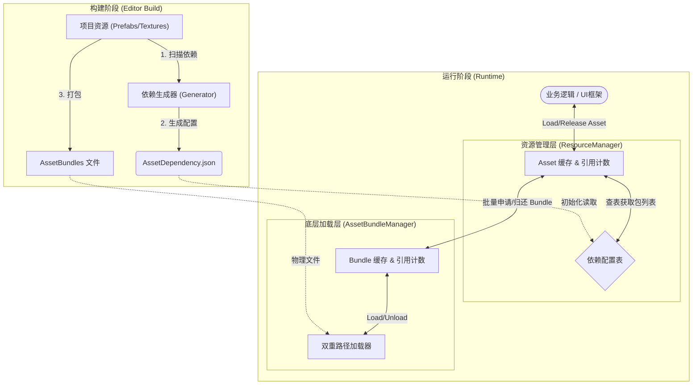
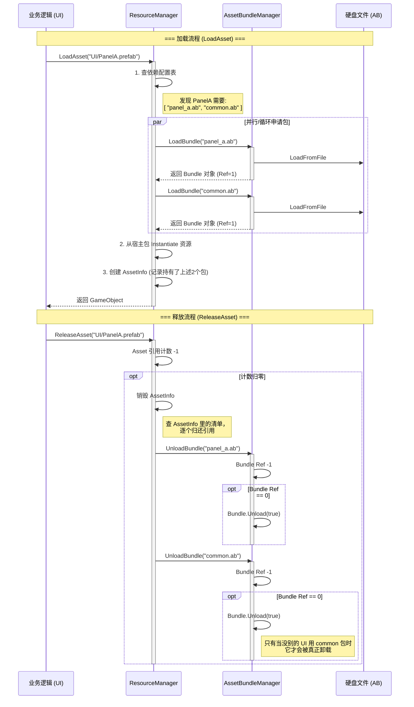

# 资源管理

## 总结：

```
维护AB包引用计数的是资源，维护资源引用计数的是使用者，当一个资源没有使用者的时候，资源的引用计数清零。当一个AB包没有资源被使用的时候，AB包的资源清零
```

## 详细

我的这个框架不适用AB包的mainManifest，而是自动生成的依赖关系，如下，json的key是资源名，value是它依赖哪些ab包，默认第一个ab包是资源的宿主包

```c#
{
  "UI/SelectIconWidget": [
    "ui"
  ],
  "UI/SelectPanel": [
    "ui",
    "icon"
  ]
}
```

基于引用计数，原则是，AB包的释放，唯一只依赖资源。资源的释放依赖调用方

比如一个具体的场景：UI框架尝试创建一个预制体a.prefab，a.prefab存在于A.ab当中，而a.prefab依赖B.ab当中的b.prefab

那么加载的时候会首先查json，然后按照顺序依次加载依赖的ab包，并且引用计数依次增加，a.prefab对应的Asset管理实例的Ref++，因为UI框架依赖它，同时A.ab和B.ab的Ref都要+1，因为a.prefab依赖，（**注意，我们的框架只关心显式加载的资源的管理**，也就是说，虽然我们使用B.ab是因为a.prefab使用了b.prefab，但是框架层不需要关心这件事情，因为这样管理也不会出问题，如果每个都关心的化，AssetInfo的GC压力比较大）

卸载的时候，a.prefab卸载之后，B.ab的Ref-1，这时候发现已经是0了，那么就可以卸载了（结合上面的问题，如果有两个prefab，引用了B.ab里不同的资源，这时候也会等到两个prefab都释放了才会释放B.ab，因为，获取和释放Asset的时候，AB包引用计数的变化，是根据上面Json去主动增减的，所以这个加减是对的上的）

> 来推演一个**“两个 Prefab 引用同一个包里不同资源”**的具体例子。
>
> ------
>
> ### 场景设定
>
> 1. **资源 A**: `Assets/UI/ShopPanel.prefab`
>    - 它引用了 `Common.ab` 里的 `Button_Yellow.png`。
> 2. **资源 B**: `Assets/UI/RankPanel.prefab`
>    - 它引用了 `Common.ab` 里的 `Button_Blue.png`。
> 3. **依赖包**: `Common.ab` (包含 Yellow 和 Blue 两张图)。
>
> **`AssetDependency.json` 配置表：**
>
> ```JSON
> {
>   "UI/ShopPanel.prefab": [ "ui/shop.ab", "ui/common.ab" ],
>   "UI/RankPanel.prefab": [ "ui/rank.ab", "ui/common.ab" ]
> }
> ```
>
> ------
>
> ### 详细流程推演
>
> #### 阶段 1：加载 ShopPanel (商店界面)
>
> 你调用 `LoadAsset("UI/ShopPanel.prefab")`。
>
> 1. **查表**：发现需要 `["ui/shop.ab", "ui/common.ab"]`。
> 2. **加载 `ui/shop.ab`**：
>    - `AssetBundleManager` 检查缓存 -> 无。
>    - 物理加载 -> **Ref = 1**。
> 3. **加载 `ui/common.ab`**：
>    - `AssetBundleManager` 检查缓存 -> 无。
>    - 物理加载 -> **Ref = 1**。
> 4. **创建 AssetInfo**：
>    - `AssetInfo(Shop)` 记录持有：`[shop.ab, common.ab]`。
>
> **【此时内存状态】**
>
> - `Shop.ab`: **1**
> - `Rank.ab`: **0** (未加载)
> - `Common.ab`: **1** (被 Shop 引用)
>
> ------
>
> #### 阶段 2：加载 RankPanel (排行榜界面)
>
> 你调用 `LoadAsset("UI/RankPanel.prefab")`。
>
> 1. **查表**：发现需要 `["ui/rank.ab", "ui/common.ab"]`。
> 2. **加载 `ui/rank.ab`**：
>    - 物理加载 -> **Ref = 1**。
> 3. **加载 `ui/common.ab`**：
>    - `AssetBundleManager` 检查缓存 -> **有！**
>    - **Ref 1 -> 2** (关键点！)。
> 4. **创建 AssetInfo**：
>    - `AssetInfo(Rank)` 记录持有：`[rank.ab, common.ab]`。
>
> **【此时内存状态】**
>
> - `Shop.ab`: **1**
> - `Rank.ab`: **1**
> - `Common.ab`: **2** (被 Shop 和 Rank 同时引用)
>
> > **注意**：虽然 Shop 用的是黄按钮，Rank 用的是蓝按钮，但它们都指向同一个**物理容器 `Common.ab`**。所以包的计数正确增加。
>
> ------
>
> #### 阶段 3：关闭 ShopPanel
>
> 你调用 `ReleaseAsset("UI/ShopPanel.prefab")`。
>
> 1. **销毁 AssetInfo(Shop)**。
> 2. **归还引用**：查它的小本本，发现要释放 `[shop.ab, common.ab]`。
> 3. **释放 `ui/shop.ab`**：
>    - Ref 1 -> 0。
>    - **真正卸载** `ui/shop.ab`。
> 4. **释放 `ui/common.ab`**：
>    - Ref 2 -> 1。
>    - **不卸载**。
>
> **【此时内存状态】**
>
> - `Shop.ab`: **0** (已销毁)
> - `Rank.ab`: **1**
> - `Common.ab`: **1** (Rank 还在用它，尽管 Shop 已经不关心它了)
>
> > **验证你的说法**：Shop 释放了，Common 包的 Ref 减了 1，变成了 1，没有归零，所以活着。这完全符合逻辑。
>
> ------
>
> #### 阶段 4：关闭 RankPanel
>
> 你调用 `ReleaseAsset("UI/RankPanel.prefab")`。
>
> 1. **销毁 AssetInfo(Rank)**。
> 2. **归还引用**：查小本本，释放 `[rank.ab, common.ab]`。
> 3. **释放 `ui/rank.ab`**：
>    - Ref 1 -> 0。
>    - **真正卸载**。
> 4. **释放 `ui/common.ab`**：
>    - Ref 1 -> 0。
>    - **真正卸载**！
>
> **【此时内存状态】**
>
> - 全部清空。


## 架构图







